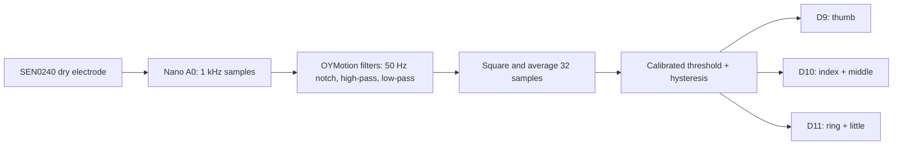

# Architecture

One EMG channel commands all groups. There is no independent finger selection or grip-force feedback. Five seconds of relaxed calibration sets an initial noise threshold; an 80 ms activation check limits brief triggers. Relaxation opens the fingers and a three-second grip timeout requires relaxation before another closure.

The original Phoenix palm and finger geometry are retained. Three motors sit in a separate strap-mounted carrier. Floating equalisers split the two paired outputs. The supplied CAD is based on reference servo envelopes, not measurements of the owned generic units.

A protected two-cell battery supplies separate 5 V servo and logic regulators. Motor return currents go directly to distribution/star ground. The sensor and Nano use the logic branch. The circuits share ground and are not galvanically isolated.

Details: [firmware](firmware/README.md), [wiring](docs/WIRING.md), [mechanics](cad/README.md).
