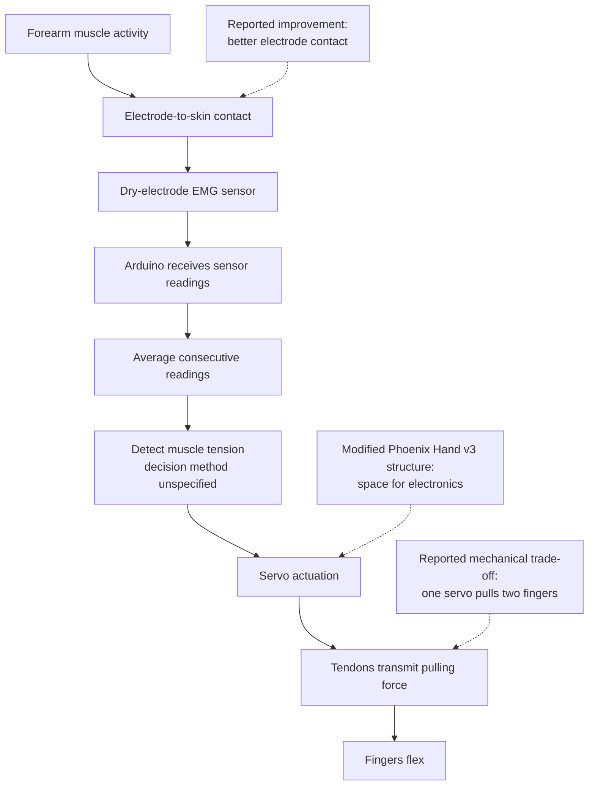

# Project architecture

## Basis and limits

This document translates the author's description of the built project into a system architecture. Reported actions are not independently verified test results. No component specifications, wiring, dimensions, firmware, thresholds or numerical performance results are inferred where the description does not provide them.

## Functional path

The diagram describes the signal and actuation path, not a wiring diagram. Supply rails, grounds, protection and physical interfaces are not yet specified.

## Subsystems

| Subsystem | Reported implementation | Detail still needed |
| --- | --- | --- |
| Mechanical platform | Modified e-NABLE Phoenix Hand v3 with space for electronics | CAD changes, hand scale, dimensions, materials and mounting features |
| Sensing | Dry-electrode EMG measurement of forearm muscle activity | Sensor model, electrode layout, output type and electrical interface |
| Signal quality | Improved forearm electrode contact and averaging consecutive Arduino readings | Contact method, sample rate, averaging window and recorded signals |
| Control | Muscle tension causes servo-driven finger actuation | Detection rule, thresholds, calibration, timing and release behaviour |
| Actuation | Servos pull tendons to flex the fingers | Servo models/count, movement limits, tendon routing and return mechanism |
| Coupling | One servo was found capable of pulling two fingers | Which fingers, complete mapping and simultaneous-load assumptions |
| Torque sizing | Calculation used to assess required finger-actuation torque | Tendon force, effective lever radius, friction, servo supply voltage and margin |
| Power and integration | Electronics packaged within a compact form | Power source, voltage rails, current budget, grounding and protection |

## Design reasoning

### Signal quality

The reported interference problem was addressed through two measures: improving electrode contact with the forearm and averaging consecutive readings in the Arduino code. The intended result was a steadier signal for detecting muscle tension.

The description does not specify whether the sensor provides raw EMG or an already processed output. That distinction must be confirmed before reconstructing the processing. No rectification, filter cutoff, averaging window or threshold is asserted here.

### Compact actuation

The packaging constraint motivated a mechanically coupled arrangement: one servo pulls two fingers. This trades independent finger control for more compact actuation. The author reports checking the required torque, but no numerical calculation or measured load is included in this release.

The description does not establish the total number of servos or whether the same arrangement is used across every finger.

### Control boundary

The description establishes an input-to-actuation path. It does not establish hand-level feedback from finger position, grip force or tendon tension. Such feedback must not be claimed as part of the current architecture without supporting implementation details.

Relaxation behaviour, reopening, start-up behaviour and responses to sensor faults remain unspecified.

## Reconstruction and verification

Before a buildable implementation is released:

1. Record the actual board, sensor, servos, power arrangement and wiring.
2. Recover or recreate the mechanical modifications and document their differences from upstream.
3. Specify the signal processing, contraction detection, actuation limits and release behaviour.
4. Publish the torque calculation with its assumptions and actuator-to-finger mapping.
5. Validate the reconstructed system on the bench and record the observed results.

Recreated files must carry their actual creation history. Recovered originals and newly written replacements should be distinguished, and test claims should refer to the version actually tested.
