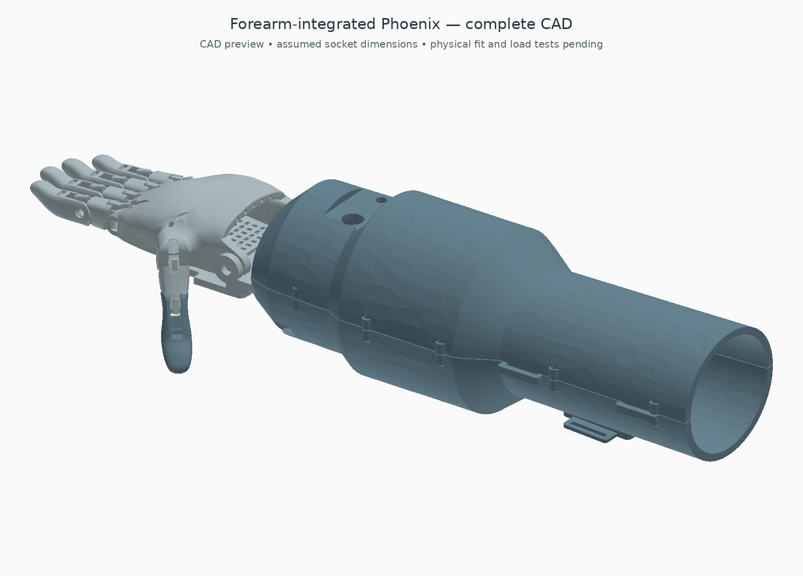

# Bionic Prosthetic Hand

A three-servo adaptation of the e-NABLE Phoenix Hand v3, using a DFRobot SEN0240 dry-electrode EMG sensor and an Arduino Nano.

One servo drives the thumb, one drives the index and middle fingers, and one drives the ring and little fingers. The controller commands closure on contraction and opening on relaxation; mechanical operation remains untested. The original palm and finger shapes are retained.

## Latest routing variant — tendon drums underneath

The [bottom-drive candidate](cad/bottom_drive/README.md) inverts the three motors inside the enclosure and lowers the cord exits by 29.9–42.1 mm. The arm adapter and original hand are retained. A bolted upper motor carrier replaces reliance on hanging ties. Ideal pulling force is unchanged; reduced friction remains a bench-test question.

## Lower enclosure and rigid arm adapter

The [lower box and arm adapter](cad/cuff_box_compact/README.md) reduces enclosure height by 23.2%, retains one motor per pair of fingers, and adds a bolted arm carrier and palm receiver. It requires the shorter replacement-servo candidate; actual component fit and fitted use remain unverified.

## Earlier alternative — removable box above the original cuff

The [separate cuff-box design](cad/cuff_box/README.md) keeps the Phoenix hand and original gauntlet geometry unchanged. Three servos and upright Nano/EMG boards fit inside a strap-on enclosure; the battery stays external. This is a separate, minimally invasive packaging option. Its cuff view is an envelope, and wrist stabilisation and wearer fit remain unresolved.

## Current design — components inside the forearm

[Start with the 0.4.3 forearm guide](cad/forearm/README.md). A split, curved arm shell houses the motors, battery, electronics and tendon mechanism; the separate top box is removed. The original v3 placemat confirms the finger order; the previously inverted fingertips are now rolled correctly, with their pads toward the palm. The thumb now uses the original palm hinge, and the added side bracket is removed. The maximum forearm section is about **102 × 102 mm**. This version retains the low-profile replacement-servo candidate and revised power requirements.

[Hand layout close-up](cad/forearm/exports/hand_layout_preview.png) · [See the internal arrangement](cad/forearm/exports/open_preview.png) · [Electronics underneath](cad/forearm/exports/electronics_preview.png) · [Complete STEP](cad/forearm/exports/complete_forearm.step)

**Remaining limits:** the model assumes 160 mm from residual-limb end to wrist. Corrected fingertip poses pass the sampled collision checks, but recipient dimensions, continuous joint motion, tendon load and real hardware fit still need validation before this becomes a functional or fitted hand. The assembly reserves empty limb space rather than filling it with components.

## Adjustable hand sizing

The [sizing study](cad/sizing/README.md) adds an editable Phoenix scale percentage and independent arm-clearance dimensions. It preserves the original hand proportions and corrected fingertip orientation while keeping hardware full size. The illustrated 120% hand is a comparison, not a selected wearer size. The [new receiver and matching assembly](cad/sizing/ADAPTER.md) connect that hand to the housing with local screw-head clearances in the lower shell. An individually fitted socket remains outstanding.

## Build files

- [Arduino code and setup](firmware/README.md)
- [Wiring diagram](docs/WIRING.md)
- [Editable CAD, STEP and printable STL files](cad/README.md)
- [Right forearm attachment and movable EMG holder](cad/arm_interface/README.md) — unfitted concept
- [Bill of materials and cost allowances](BOM.md)
- [Candidate force and travel calculation](cad/slim/README.md#force-screen) · [Earlier generic-servo calculation](calculations/README.md)
- [Measuring tendon force](TENDON-TEST.md)
- [Checks performed](VALIDATION.md)
- [What remains](TODO.md)

## Earlier layouts

[The 0.3 smaller top-box candidate](cad/slim/README.md) and [0.2.1 external housing](cad/bionic/README.md) remain as history and sources for reused parts. Their assembly previews predate the finger assignment and thumb placement corrections. Use the 0.4.3 guide for current part selection; do not combine old shells or receivers with it.

[Simple averaging code](firmware/README.md) · [Current mechanical hardware](cad/forearm/README.md#selected-parts-and-hardware)

## Status

This is a newly reconstructed bench-prototype design. The Nano sketch compiles and the software control tests pass. The newly generated add-on parts pass solid/mesh checks; some original Phoenix STEP-to-STL conversions fail watertightness checks, so use the official source STLs. The hardware has not been assembled or tested: motor fit, tendon load, grip performance, electrical noise and thermal performance remain unverified.

The servos owned for this project are generic units advertised as 25 kg·cm with 180° travel. DS3225 dimensions and 5 V electrical specifications are used as a reference, not as identification of those units. The initial code uses a small test movement; calibrate endpoints before expecting full finger closure.

The source project description mentions improved electrode contact, averaging sensor readings, tendon actuation and sharing a servo between two fingers. The files here implement a new version of that idea; they are not recovered original firmware or CAD, and do not establish earlier test results.

## Original design

Phoenix Hand v3 is credited by [e-NABLE](https://hub.e-nable.org/p/devices?p=e-NABLE+Phoenix+Hand+v3) to Jason Bryant, John Diamond, Scott Darrow, Andreas Bastian, Team Unlimbited, e-NABLE France and Jeremy Simon. It derives from Phoenix Hand v2 and Unlimbited Phoenix Hand, with labelled pins among the v3 changes.

The [original Thingiverse design](https://www.thingiverse.com/thing:4056253) is CC BY 4.0. The official STEP file is included unchanged; new carrier, spool, guide and equaliser parts are separate. The mechanical change is rerouting wrist-driven tendons to external servo actuation. No endorsement by the original designers is implied.

## Licences

Documentation and mechanical CAD: **CC BY 4.0**. Original firmware: **MIT**. Included OYMotion filter files: **BSD-2-Clause**, with their notices retained. Arduino's Servo library is an external **LGPL-2.1-or-later** dependency. See [LICENSE.md](LICENSE.md).

This is an educational bench prototype, not a validated fitted prosthesis.
