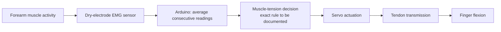

# Bionic Prosthetic Hand

An EMG-controlled, tendon-driven prosthetic-hand project based on the e-NABLE Phoenix Hand v3, exploring access to low-cost bionic prosthetics.

## Release status

This initial release documents the project architecture described by the author. CAD/STL files, Arduino firmware, wiring diagrams and test data have not yet been uploaded. This is an architecture and documentation release, not a reproducible hardware release.

The architecture records the reported build. Exact component models, dimensions, pin assignments, power arrangements and calibration values remain to be confirmed. Any newly recreated implementation will be identified as a reconstruction and validated separately.

## Build notes

The current component choices are a DFRobot/OYMotion SEN0240 dry-electrode EMG sensor and a classic Arduino Nano. The owned servos are generic units advertised as 25 kg·cm with 180° travel; their exact model is still unknown. DS3225 specifications are used only as a documented reference for supply and torque calculations.

- [Bill of materials](BOM.md)
- [Servo torque and travel calculations](SERVO-SIZING.md)
- [How to measure tendon force](TENDON-TEST.md)
- [Remaining work](TODO.md)

## Architecture at a glance

The reported design modifies the Phoenix Hand v3 to make space for electronics. Improved electrode contact and averaging successive readings were used to address signal interference. Servo-driven tendons flex the fingers when muscle tension is detected.

A reported torque calculation supported using one servo to pull two fingers, reducing the need for independent actuators within a compact assembly. Numerical calculations and the complete actuator-to-finger mapping are still to be documented.

See [ARCHITECTURE.md](ARCHITECTURE.md) for the subsystem breakdown and the distinction between reported behaviour and unspecified implementation details.

## Original design and attribution

This project builds on [e-NABLE Phoenix Hand v3](https://www.thingiverse.com/thing:4056253), credited by [e-NABLE's official catalogue](https://hub.e-nable.org/p/devices?p=e-NABLE+Phoenix+Hand+v3) to Jason Bryant, John Diamond, Scott Darrow, Andreas Bastian, Team Unlimbited, e-NABLE France and Jeremy Simon.

Phoenix Hand v3 derives from Phoenix Hand v2 and Unlimbited Phoenix Hand; its documented changes include labels on the pins to aid assembly. The original is wrist-powered. The adaptation described here adds EMG sensing, Arduino processing and servo-driven tendon actuation, with changes to accommodate the electronics.

The upstream listing uses [Creative Commons Attribution 4.0 International (CC BY 4.0)](https://creativecommons.org/licenses/by/4.0/). Original designers retain their rights. No endorsement by e-NABLE or the original designers is implied.

## Licensing

- Original documentation in this repository: **CC BY 4.0**.
- Phoenix-derived CAD/STL files and this project's modifications, when added: **CC BY 4.0**, retaining upstream attribution and notices.
- Original firmware in this repository, when added: **MIT**, excluding third-party material with its own terms.

See [LICENSE.md](LICENSE.md) for the scope, licence links and MIT text. These notices do not imply that CAD or firmware is already included.

## Intended use

Experimental educational prototype. This release does not establish clinical suitability or suitability for use as a fitted prosthesis. Hardware performance and safety require separate validation.
