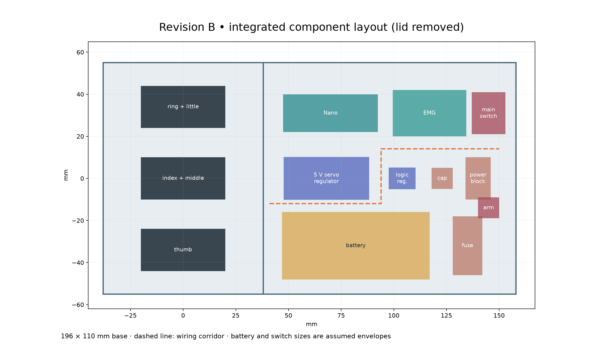
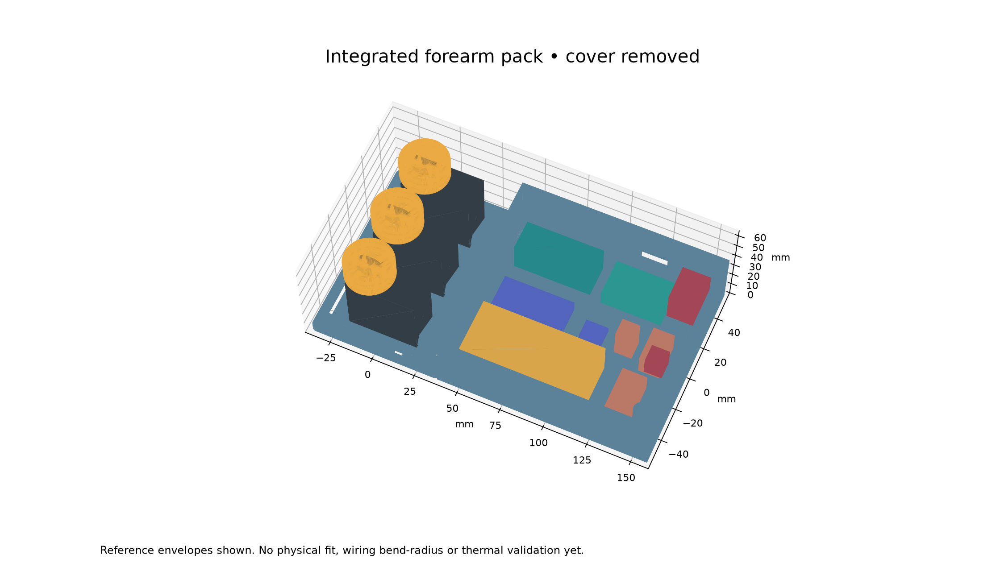

# Revision B — integrated forearm pack

This revision extends the three-servo carrier with an electronics compartment, battery pocket and removable lid. It preserves the Phoenix v3 palm and fingers. It is an editable bench prototype, not a measured fit to the owned parts or the wearer's forearm.

## Print and edit

Print **one integrated_base**, **one electronics_lid**, three two_groove_spools, two pair_equalisers and three tendon_fairleads. Do not also print the old servo_carrier; its geometry is incorporated in the new base. STEP files are editable solids. `integrated_assembly.step` contains the base, lid, motors, spools and reference component envelopes; it is not a printable single part.

Run `python cad/build.py`, then `python cad/integrate.py` with CadQuery 2.8.0, trimesh and matplotlib. The second script imports the first script's carrier and spool exports. Component dimensions and positions are collected in its `components` dictionary. The enclosure dimensions, switch holes and retention features must also be adjusted if a component changes; changing only an envelope does not automatically redesign the enclosure. The script rejects detected solid intersections.

The base is **196 × 110 × 38 mm**. The mounted spools take the nominal assembled height to **59.5 mm**, excluding padding, strap loops and switch levers. The electronics lid is **120 × 110 × 5 mm**, including its locating lip. Its STL is oriented with the flat exterior face on the print bed and the lip upward. The base prints floor down. Use a slicer to inspect horizontal cable openings for bridging/support requirements. PETG settings in the main CAD guide are starting points, not verified strength specifications.

## Small fit prints first

Run `python cad/fit_coupons.py` after generating the main CAD. Print `servo_fit_coupon.stl` to check one actual servo body, lead exit, ears and tie routing. It uses the same pocket geometry as the complete base. Print `nut_fit_coupon.stl` to check an M3 nut and screw, and `switch_fit_coupon.stl` to check both switches in a 3 mm panel. These coupons are valid watertight solids; physical fit is untested. Correct the source dimensions and regenerate before printing the full base if any coupon fails.

## What has a place

| Component | Modelled envelope, mm | Mounting / allowance |
| --- | --- | --- |
| Three servos | 40 × 20 × 40.5 each | Original three pockets and cable-tie retention; DS3225 reference only |
| Classic Nano | 45 × 18 × 19 | Insulated pad; published board outline, assumed installed height |
| SEN0240 signal board | 35 × 22 × 10 | Insulated pad; published outline, assumed component height |
| D24V90F5 servo regulator | 40.6 × 20.3 × 7.6 | Insulated pad below lid vents; added connectors are not modelled |
| D24V5F5 logic regulator | 12.7 × 10.2 × 4 | Published board outline with height allowance |
| Protected 2S battery | 70 × 32 × 22 | Assumed pack; end stops, padded support and removable 10 mm soft strap |
| Inline fuse holder | 14 × 28 × 12 | Assumed insulated holder; pad beside battery |
| Insulated power distribution | 12 × 20 × 14 | Assumed assembly, including insulation |
| Main capacitor | 10 × 10 × 20 | Assumed installed envelope; lead insulation required |
| Main switch body | 16 × 20 × 20 | Assumed body; 12.2 mm panel hole |
| Arm switch body | 10 × 10 × 12 | Assumed body; 6.2 mm panel hole |

The sensor's dry electrode stays against the forearm in its supplied belt; only its signal board belongs in this box. There is no display in this revision. Small resistors and decoupling capacitors belong in the insulated wiring assembly; their individual positions are not modelled.

Board outlines come from [Arduino Nano](https://docs.arduino.cc/hardware/nano), [DFRobot SEN0240](https://wiki.dfrobot.com/sen0240/), [Pololu D24V90F5](https://www.pololu.com/product/2866/specs) and [Pololu D24V5F5](https://www.pololu.com/product/2843/specs). Published outlines do not establish connector, solder-joint or cable clearance. Check the owned boards and headers before printing.

## Retention and access

Boards sit on 2 mm raised pads, with a nominal 1 mm nonconductive mounting layer above each pad. Use removable insulating mounting tape or low-profile hook-and-loop matching that thickness; thicker material reduces headroom. Do not cover regulator components or use conductive adhesive. There are no invented PCB mounting-hole patterns.

The battery has two end stops and floor slots for a 10 mm soft strap. Select a pack within the assumed envelope, with clearance for its leads and protection board, or resize the pocket. Do not squeeze a pouch cell into the space. Disconnect and remove the pack for charging.

Four M3 screws secure the lid through 3.4 mm holes into underside hex-nut recesses (6.6 mm across corners, 2.5 mm deep). Use four M3 nuts and washers. The total stack from lid top to underside is 41 mm: start with M3 × 45 screws, then shorten and deburr to engage the nuts fully without protruding below the base. Check recess fit on a small print first. Keep all fastener ends away from the support/padding.

A new strap station supports the electronics end. Use the leftmost motor-area slots and the new electronics-end slots for two separate 25 mm straps around a rigid bench support. The original inner slots remain available. A padded cuff that spreads load over a real forearm still needs to be designed from actual measurements; this flat plate is not that cuff.

A 14 × 12 mm wall opening provides provisional Nano USB access; its alignment assumes the USB connector points toward the motors. The electrode cable has a 16 × 10 mm side opening. A separate 18 × 14 mm opening carries motor wiring through the dividing wall. Verify connector insertion and cable bend space with the actual parts. Add smooth sleeving at printed edges and tie-down strain relief; do not rely on a connector to hold a cable.

The dashed line in the layout shows suggested wiring space, not a validated cable harness. Keep motor supply/return together, and route the EMG signal with its ground away from that bundle. Leave service loops at lid switches so the lid can open without pulling wires. Remove battery power before lifting the lid.

## Checks and remaining limits

`integration_checks.json` records valid single-solid base/lid geometry, watertight STL meshes, positive volumes and zero detected volume intersections between the ten component envelopes, base and lid. The script also checks base/lid clearance and reference servo/spool clearance against the base.

These checks exclude servo ears, real horns and screws, wires, connector bend radii, switch levers, straps, assembly tolerances and tendon motion. Vents do not establish adequate regulator cooling. The full design still needs a physical fit print, retained-component shake test, loaded tendon test, current/temperature measurements and a cuff design before any wearable assessment.
