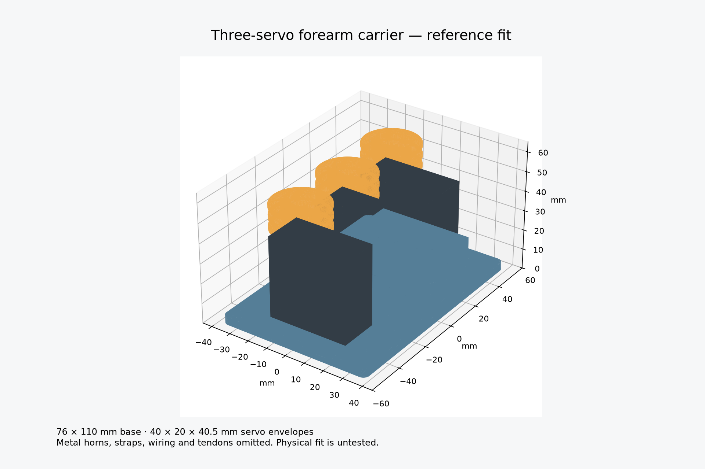

# Mechanical build

The Phoenix v3 palm, fingers and joints are kept unchanged. The new parts form an external forearm actuator pack. Tendons are rerouted from the original wrist-powered actuation to the servos. This is the current reconstruction; it is not evidence that the original project used this exact arrangement.

## Current integrated revision

Use [Revision B: integrated electronics and battery pack](INTEGRATION.md) for the complete reference assembly. It replaces the standalone carrier with `integrated_base.stl` and adds `electronics_lid.stl`. The original carrier below remains available for a smaller motor-only bench test.

## Original motor-only files

| File in `exports/` | Quantity | Purpose |
| --- | ---: | --- |
| `servo_carrier.stl` | 1 | Three standard-size servo pockets on a strap-mounted base |
| `two_groove_spool.stl` | 3 | 12 mm groove-floor radius drum; one per servo |
| `pair_equaliser.stl` | 2 | A small floating bar that divides one tendon pull between two fingers |
| `tendon_fairlead.stl` | 3 | Two-bore tie-on guide; PTFE tubing separates tendon from printed plastic |

STEP versions are included for editing. `carrier_assembly.step` includes rectangular reference servo envelopes; those are not printable motor parts. `build.py` is the parametric source, tested with CadQuery 2.8.0. Millimetres throughout. Run `python cad/build.py` to regenerate.

## Carrier and servo retention

The base is 76 × 110 × 4 mm. Each pocket accepts a 40 × 20 mm reference body with 0.5 mm clearance per side. Retaining walls rise 11 mm above the base. There are cable exits and slots for a 4.8 mm tie around the rear of each motor, clear of the assumed output shaft position. Four outer slots take two 25 mm straps; a foam layer belongs between the plate and its support.

This is a test-fit fixture. The reference body dimensions are from DS3225 data; ear shape, lead exit, shaft offset and horn height are not established for the owned servos. The drawing uses a 10 mm shaft offset from the body centre and 3 mm horn clearance as layout assumptions. Check these before printing the full carrier. Servo ears must remain above the short walls and ties must clear the rotating horns. If the body is larger, edit `BODY_L`, `BODY_W` and clearance rather than forcing it into a pocket.

Use the carrier on a bench fixture first. Its width is 110 mm and its nominal assembled height is about 60 mm; this is not a compact palm enclosure or a fitted medical cuff. Final forearm attachment needs actual dimensions and a comfortable load-spreading cuff. It has no direct screw-hole attachment to a Phoenix part, so no Phoenix mounting-hole alignment is claimed.

## Horns and spools

Bolt each printed spool to a metal horn that fits the actual servo spline. Do not try to print a replacement spline. The spool has two 2.3 mm-wide mounting slots centred 8 mm either side of its axis and 6 mm central screwdriver access. Match a horn whose holes fit those slots; otherwise edit the slot positions. Reuse the correct manufacturer horn-retaining screw. Two M2 bolts and nuts per spool are a starting attachment specification; verify bolt length and clearance against the selected horn.

Each groove is 3.75 mm wide. Feed and knot the tendon through its radial anchor hole. Keep one layer of winding: effective radius is the 12 mm groove floor plus half the line diameter. For 0.6 mm line it is approximately 12.3 mm; use that in the torque/travel calculation. Verify the knot clears neighbouring parts and cannot pull through.

## Finger grouping

- D9: thumb; a single line from spool to thumb tendon.
- D10: index and middle; a line from one spool groove to the centre of an equaliser, with the finger tendons tied to its two outer holes.
- D11: ring and little; the same equaliser arrangement.

The unused second spool groove is a spare. Using an equaliser avoids forcing both paired fingers through identical displacement. The bar has 20 mm between outer holes and can accommodate some difference by tilting. Leave room for that motion and keep it away from the other lines. It is not unlimited compensation: if it flips or reaches a stop, stop and adjust the routing. The spool moves approximately the average of the two finger tendon displacements, and its input load is their sum in the nearly parallel arrangement. Measure the real coupling rather than assuming the direct two-groove model in the earlier sizing note.

Retain Phoenix return bands and joints. Disconnect the flexor lines from the original wrist-powered tensioner and route five finger tendons to these three groups. The carrier does not require cutting the original palm. Use the guide blocks at the carrier exit, with 2 mm OD / 1 mm ID PTFE liners and generous bends. Tie the guides to a fixture or cuff; do not leave them unsupported. No exact guide-to-palm path is claimed without hand scale and wrist geometry. Wrist motion can change tendon length, so keep the wrist at a fixed position for the first bench test.

## Printing and inspection

Start with PETG, 0.2 mm layers, four perimeters and approximately 40% infill as trial settings. Print carrier base down, spools axis vertical and equalisers flat. Horizontal cable/anchor bores may need careful clearing; inspect every guide for sharp edges. Print one spool and a pocket test before committing to the full set. These settings are not strength validation.

All four generated parts pass single-solid validity and watertight STL checks. The servo-envelope check finds no volume overlap with the carrier. These checks do not verify actual servo fit, tie retention, layer strength, horn screws, wear or load capacity.

## Original Phoenix file

`upstream/phoenix_v3.step` is the unchanged STEP download linked by the e-NABLE Phoenix v3 catalogue. It imports as 32 solids. SHA-256: `3d7086af7fd8a3b8f33ca87d8af6b10bdc7fc9038eb923bf920633acd7227620`.

Source: https://drive.google.com/file/d/1qt4fIh77aN9F0LTXMMZCiVgzgbxBcUQ3/view
Catalogue and attribution: https://hub.e-nable.org/p/devices?p=e-NABLE+Phoenix+Hand+v3

Phoenix v3 by Jason Bryant, John Diamond, Scott Darrow, Andreas Bastian, Team Unlimbited, e-NABLE France and Jeremy Simon; based on Phoenix v2 and Unlimbited Phoenix. Upstream geometry is CC BY 4.0. New mechanical parts and their parametric CAD source are also CC BY 4.0. No endorsement is implied. Use the official assembly and sizing instructions for the original hand; do not infer recipient fit from this STEP file's scale.
