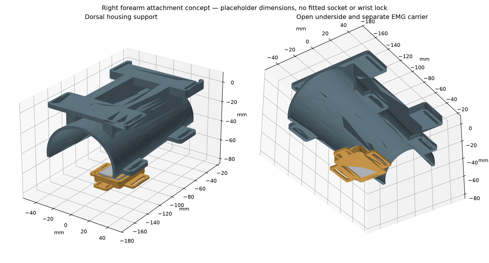

# Right forearm attachment and movable EMG carrier

**Unfitted bench concept, not a prescribed socket.** This adds an open dorsal saddle to the current right-hand Phoenix assembly and a separately strapped dry-electrode carrier. The user specified a right residual forearm; usable length, shape, skin condition and socket dimensions have not been supplied. The open saddle is a mechanical packaging study and does not establish suspension, anti-rotation, comfort or wearable acceptance.



## What was added

- A tapered, open-bottom forearm saddle, 140 mm long, nominally 3 mm shell thickness. The electronics sit on dorsal ribs above it. The front bridge steps under the existing wrist-cradle plate.
- Two housing-strap stations aligned with the existing 25 mm strap slots; two separate 20 mm support-strap stations at the open edges. Webbing, padding and closures are not modelled. These are trial retention features, not rated load connections.
- A movable electrode carrier with an open contact face, separate 20 mm soft-band slots, connector opening and back-side cable strain-relief tab. Its band is independent of the main support straps so electrode position does not require tightening structural straps.
- A full reference STEP containing the right Phoenix hand, compact housing, saddle and electrode holder. The original Phoenix geometry stays unchanged; the thumb remains deliberately exploded and the wrist lock remains unfinished.

## Electrode placement and actual dimensions

The sensor measures through **skin over a muscle belly**, not by targeting fatty tissue or contacting exposed muscle. DFRobot specifies alignment with muscle direction and contact on exposed skin. The opening allows the holder to be repositioned longitudinally and around the open side, using a separate soft band. The illustrated location is not a clinically selected muscle site. A prosthetist/therapist should select a usable residual muscle and assess fit and skin pressure.

DFRobot lists the dry-electrode board as 22 × 35 mm, with a 50 cm lead. The CAD pocket allows 1 mm clearance on each side. **Thickness is assumed to be 6 mm**, not a manufacturer-confirmed package height. The sensor envelope projects 1 mm beyond the surrounding rigid wall in this assumption; this does not prove that its metal pads actually touch the skin. Measure the full housing, metal-contact protrusion, connector and cable before printing the holder. The 22 × 35 mm signal conditioner stays in the electronics housing; it is a separate part from the electrode board.

Do not put a liner or rigid printed plate between the metal electrodes and skin. The main liner arrangement must be designed around the electrode access by the fitter; do not cut or modify an existing prescribed liner. Use the supplied soft electrode belt where possible. A soft restraint across the back of the probe is still needed to prevent it escaping the pocket; do not cover the contact face. The CAD provides no screw or spring that forces electrodes into tissue. Bench-check cable slack and strain relief during movement. Keep motor power returns and moving tendons away from the probe lead.

## Placeholder geometry and fitting inputs

`parameters.json` stores the fixture dimensions:

| Parameter | Current placeholder |
| --- | ---: |
| Saddle length | 140 mm |
| Distal inner ellipse, width × depth | 54 × 50 mm |
| Proximal inner ellipse, width × depth | 70 × 64 mm |
| Nominal shell thickness | 3 mm |

These describe a CAD lumen, not the user's limb and not a fit allowance. No anatomical scan, liner thickness, compression or pressure distribution is represented. Changing ellipse dimensions changes the shell; ribs, strap stations and housing datums must also be reviewed after any parameter change. Straps offer opening adjustment; they do not turn a generic shell into a fitted socket.

Required next inputs: right residual-limb usable length from elbow crease, circumferences at clearly recorded distances from the end, width/depth or scan at those stations, limb-end shape, elbow clearance, existing socket/liner details, and selected EMG site. Circumferences alone cannot define a comfortable socket. The hand and motor module may add unacceptable distal length or offset for a long residual limb; anatomical alignment is unresolved.

## Files and build

```sh
python cad/arm_interface/build.py
```

Requires the existing compact and Phoenix assembly exports plus CadQuery 2.8.0, trimesh and matplotlib.

- `exports/right_open_saddle.step` / `.stl`: new saddle, exported with minimum Z at zero.
- `exports/emg_band_carrier.step` / `.stl`: separate sensor holder.
- `exports/right_arm_reference.step`: complete reference placement; not print-in-place.
- `checks.json`: solid, mesh and static collision results.

Z=0 is not a validated print orientation. Review supports and layer direction, edge finishing, strap-slot strength and access in a slicer. First print or machine a small interface sample and use a dummy forearm fixture. Skin-contact material, edge radii, cleaning and liner requirements need fitting review; this print is not approved for direct skin wear.

## Added reference BOM

| Item | Quantity | Requirement |
| --- | ---: | --- |
| Open saddle | 1 | Prototype print only |
| EMG carrier | 1 | Fit to measured electrode housing |
| 25 mm housing webbing | 2 | Uses existing housing stations; lengths from bench mock-up |
| 20 mm support webbing with releasable closures | 2 | Trial only; does not establish secure limb suspension |
| Independent 20 mm soft electrode band | 1 | Prefer supplied belt if compatible; do not use as structural retention |
| Soft back restraint / removable retainer for probe | 1 | Keep all metal contacts exposed |
| Cable restraint | 1 | Around cable jacket, with service loop; avoid crushing lead |
| Fitted liner, suspension and final socket | Pending | Cannot specify from placeholder geometry |

No cost total has been invented for patient-specific parts. Wrist axle retention and a neutral-position lock are still required before loaded actuation. Static CAD clearance does not demonstrate strength, retention, safe pressure or EMG signal quality. Test sensing first with motors disconnected; the existing averaging code is unchanged.

## Statement requirements checked locally

The personal-statement v4 document was read from its current text data and its embedded preview on 5 October 2026. Its relevant requirements are: Phoenix v3 adaptation, compact electronics, dry-electrode forearm sensing, improved electrode contact, Arduino averaging and tendon actuation with paired fingers. The statement does **not** define socket dimensions or prove this new interface works. No private document is included here.

The current firmware implements a 32-sample mean of squared filtered EMG. This matches the averaging design direction; reduced interference and functional grip still require recordings and physical tests. New CAD and calculations do not substantiate historical performance claims by themselves.

## References

- [DFRobot SEN0240 dimensions and placement](https://wiki.dfrobot.com/sen0240/), checked 5 October 2026.
- [DFRobot electrode placement guide](https://wiki.dfrobot.com/sen0240/docs/20735).
- [NHS upper-limb prosthesis fit advice](https://www.stgeorges.nhs.uk/wp-content/uploads/2025/10/PRS_ULA_02.pdf).
- [NHS skin management for prosthetic users](https://www.leedsth.nhs.uk/patients/resources/skin-management-and-general-care-advice-for-prosthetic-users/).

New geometry and documentation: CC BY 4.0. Inherited Phoenix attribution remains in the main CAD documentation. Generated with AI assistance under the project owner's direction.
