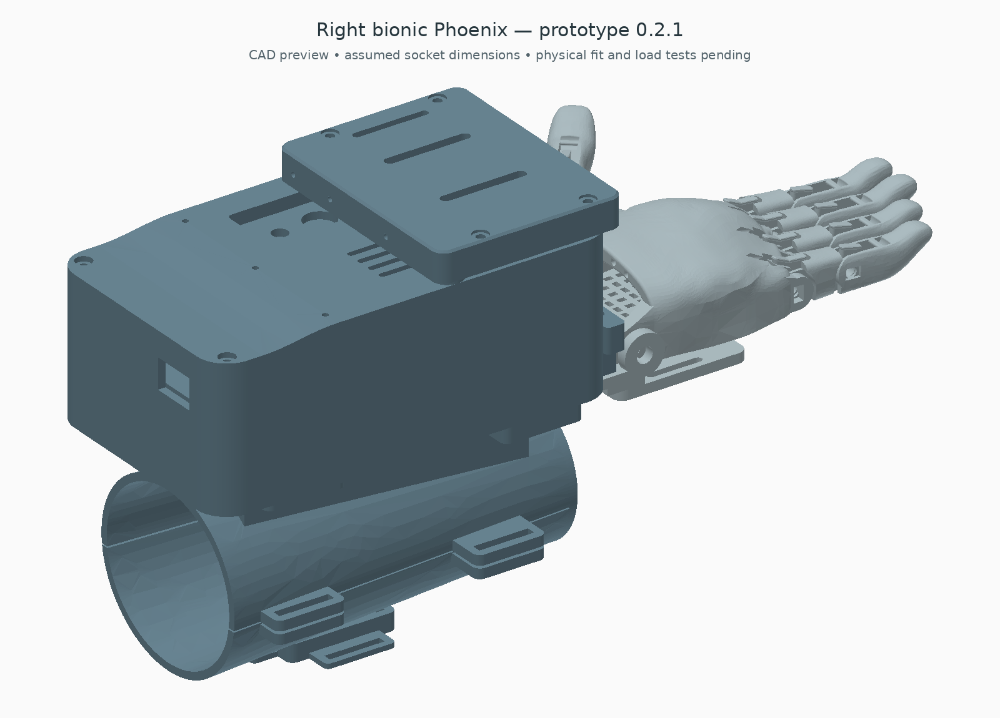

# Right bionic Phoenix integration — prototype 0.2.1

**Historical layout:** [0.4.0 forearm integration](../forearm/README.md) is the current candidate. It corrects the index/ring distal-part assignment and open thumb placement shown in older assembly previews. Only reuse files explicitly selected by that guide.


This is the current integrated CAD for a right residual forearm with no hand. It combines the Phoenix palm and fingers, a fixed palm receiver with a connected thumb fork, a two-part forearm shell, component housing, and a removable tendon-drive cassette. Limb dimensions are placeholders; a fitted socket, suspension and load acceptance require individual assessment.



## Small exterior refinement — 0.2.1

The cassette now has continuous rounded walls matching its floor and lid, with 5 mm outer and 2 mm inner corner radii. A 0.8 mm chamfer softens the top lid edge. Four 6.2 mm diameter, 1 mm-deep screw-head seats reduce head protrusion while leaving 2 mm of cover below each seat; these are shallow recesses, not flush-head guarantees. The thumb-support plate has 5 mm rounded corners.

Housing size, cassette height, mounting centres, tendon ports, slider travel, source hand and component placements are retained. The new corners do not establish better strength or lower routing friction. No firmware changes are needed for this revision.

## Hand and attachment

The original Phoenix right palm and all finger solids retain their source shape and scale. No hole is drilled in the source palm. The new receiver uses the original wrist bores for an axle and supports the palm from below. Two M4 adjustment positions and a separate 20 mm palm-retention strap restrain rotation; fit and clamp load must be established on a bench. This is an added restraint arrangement, not a certified wrist lock.

The thumb is connected to a new fork on the receiver. Its source proximal and distal shapes remain intact; the root moves 18 mm outward and 6 mm upward. The fork points the thumb forward toward the fingers on a 50-degree in-plane axis. The new fork has 4.6 mm bores and 7.6 mm between its cheeks. Use a measured shoulder axle/bolt with washers and axial retention; a nominal 4 mm shoulder is a starting reference, with its play checked against the original 4.6 mm thumb bore. Do not tighten the cheeks onto the moving thumb. Root-body relief is cut in the new fork at sampled 0/15/30/45-degree positions. This establishes sampled root clearance, not full thumb articulation or grasp performance. Original pin E is not automatically compatible with the new fork.

The dorsal forearm shell closes at its distal end and accepts a removable ventral door. Separate releasable webbing joins their external strap stations. The door has a rounded 28 × 45 mm electrode access opening; the electrode itself is strapped independently to skin over a selected muscle belly. The signal board stays in the housing. The shell opening and movable holder allow access, but actual probe thickness/contact protrusion and skin pressure remain unverified.

Current lumen: 140 mm long, tapering from 54 × 50 mm distal to 70 × 64 mm proximal. These are fixture dimensions, not a prescription for the recipient. The liner, limb-end clearance, elbow clearance and anti-slip suspension must be designed around measured anatomy. This design does not require a functional wrist to power the fingers; its motor-driven actuation replaces that original Phoenix function. A prosthetist should fit the limb interface before powered wear.

## Component housing and drive cassette

Retain the compact base and tray. Use this folder's `housing_lid_with_feedthroughs` instead of the older compact lid. It provides three 2.4 mm liner-entry holes and restores the full cover thickness at the two cassette bearing seats. The Nano, SEN0240 signal board, reference battery, two regulators, fuse, switches and wiring spaces retain the compact layout. Battery, switch, servo-ear and added connector envelopes still need physical measurement.

The cassette bolts over the forward housing using its existing two front fastener positions. It adds space for two equalisers and one thumb-line slider; its lid is removable for access to knots and lines. Four 4.2 mm × 4 mm insert pockets receive selected M3 inserts; verify the insert's actual outer size and the printed boss before installing. The two cassette feet are 12 mm diameter to spread the mounting load on the cover.

The housing alone remains 94 × 160 × 60 mm. The cassette reaches assembly Z=77 mm, compared with the housing roof at Z=64 mm. The added drive space increases the package height. Flexible tubing/knots and fittings can extend farther; measure them before deciding the final outline.

The 7 mm internal floor-to-cover height leaves 1 mm below and 2 mm above the 4 mm bars and prevents a full 90-degree roll of their 8 mm-wide cross-section. Keep knots within the available top clearance; verify this with actual line.

The bars have 20 mm between finger-output holes. Their centre travel is 38 mm, sampled at three positions with ±30° tilt and the neutral pose. At ±30° an ideal bar accommodates about 10 mm difference between output travel. If one finger needs more difference, the bar hits its constraint and the assumed sharing no longer applies. The thumb has a separate guided line slider. This is a passive one-channel grasp: all groups move together from the single EMG control signal.

### Tendon connection map

Directions below use assembly coordinates: +Y points toward the fingers; left/right mean the pictured right-hand device, not a recipient fit prescription.

| Servo signal / physical position | Spool line | Cassette input | Cassette output |
| --- | --- | --- | --- |
| D9 / motor at X=-28 mm | Thumb | X=-37 mm rear port → thumb slider rear hole | Slider front hole → X=-37 front port → wrist comb → existing thumb route |
| D10 / motor at X=0 | Index/middle | X=-16 rear port → equaliser centre | Two outer holes → X=-26/-6 front ports → wrist comb → original two finger paths |
| D11 / motor at X=+28 mm | Ring/little | X=+16 rear port → equaliser centre | Two outer holes → X=+6/+26 front ports → wrist comb → original two finger paths |

One groove per servo. Keep a single winding layer and use 2 mm OD / 1 mm ID PTFE where appropriate. Three entry holes in the housing lid take the motor-side liners; route to the cassette's rear input ports with generous external bends. Five cassette output ports feed the wrist guide comb. The guide comb is mounted to the receiver with two M3 fasteners; its five 2.2 mm seats support the outgoing liners. Finish these paths into the **existing Phoenix tendon passages** following its assembly instructions. No rigid tube should bridge a moving finger joint.

Cord lengths, liner cut lengths, bend radii, plug clearance and knots must be set on a bench with the real hand and hardware. Flexible cords/tubes and their slack loops are not represented as validated swept geometry in the STEP. The ports and guide seats are real CAD features; the connection map defines the required installation. Use the cassette's removable cover to reach each input tie and release tendon tension manually after removing motor power; this is not a demonstrated emergency-release mechanism.

## Print list

| File | Quantity |
| --- | ---: |
| `socket_dorsal.stl` | 1 |
| `socket_ventral_door.stl` | 1 |
| `fixed_palm_receiver.stl` | 1 |
| `tendon_cassette_base.stl` | 1 |
| `tendon_cassette_cover.stl` | 1 |
| `thumb_line_slider.stl` | 1 |
| `wrist_guide_comb.stl` | 1 |
| `housing_lid_with_feedthroughs.stl` | 1 |
| `../compact/exports/compact_base.stl` | 1 |
| `../compact/exports/compact_tray.stl` | 1 |
| `../compact/exports/single_groove_spool.stl` | 3 |
| `../exports/pair_equaliser.stl` | 2 |
| `../arm_interface/exports/emg_band_carrier.stl` | 1 |

For the original right hand use the [official Phoenix v3 print files](https://www.thingiverse.com/thing:4056253) and the selected recipient scale. Some trial source STEP-to-STL conversions were not watertight and remain withheld. Source STEP bodies are included for editing/provenance. Regenerate new mounting geometry after choosing the scale; do not scale the servo, board or fastener features indiscriminately.

The new exports have minimum Z at zero; that is not a verified print orientation. Review the receiver fork, socket curves, ports and curved cover for support access and layer direction. Fit-test one bearing, spool/horn, insert seat and electrode holder before full printing. Material choice, skin-contact surfaces, cleaning, strap closures and liner are part of the fitting stage.

## Added hardware

| Item | Quantity | Fit/selection requirement |
| --- | ---: | --- |
| Retained wrist axle | 1 | Approximately 6 mm nominal; span the new 74 mm cradle width, with suitable end retention; check actual bores |
| Axle collars/end retainers | 2 | Outside the cradle cheeks; verify plain axle support and service access |
| Thumb shoulder axle/bolt, spacers, washers and locknut | 1 set | New 4.6 mm fork bores and original thumb bore; approximately 4 mm shoulder reference, adequate bearing length and checked play |
| M4 receiver-to-housing bolts, washers/nuts | 2 sets | Existing 36 mm transverse pitch; select length from actual floor/receiver stack |
| M4 adjustable lower stops with locknuts and soft pads | 2 sets | Seat on the printed palm; adjust without distortion; pads/load not validated |
| 20 mm palm-retention webbing with releasable closure | 1 | Around printed palm/receiver only; keep return bands, tendons and thumb clear |
| M3 front housing/cassette screws | 2 sets | Longer replacement for two original front cover screws; measure stack and nut engagement |
| M3 rear housing screws | 2 sets | Current rear cover stack; inspect head seats |
| M3 cassette-cover screws | 4 | 6.2 mm diameter × 1 mm-deep head recess, 2 mm remaining seat; measure actual head and insert/cover stack; ends must not reach moving lines |
| M3 heat-set inserts | 4 | CAD pockets 4.2 mm diameter × 4 mm; exact insert and boss fit verified first |
| M3 wrist-comb screws/nuts/washers | 2 sets | Select for actual comb/receiver stack and nut access |
| 20 mm shell-retention webbing with releasable closures | 2 | Trial shell stations; individual suspension still requires design |
| 20 mm independent soft EMG band and back retainer | 1 set | Contacts exposed, no rigid pressure screw |
| PTFE and braided line | Measured lengths | Three inputs, five outputs; cut after routing and stroke testing |

Retain the electronic/power BOM, three metal horns and M2 spool fixings, battery restraint, insulating board pads and tray screws. These additions are not included in the older revision B price total. Exact purchase choices depend on measured hardware and fit.

## Firmware

Open `firmware/ProstheticHand/ProstheticHand.ino` with its adjacent files. It reads A0, filters the EMG, squares it and takes a 32-sample moving mean. Relaxed calibration chooses a starting threshold; contraction commands all three servo groups, relaxation opens them. Arming and the hold timeout remain. See [simple averaging explanation and setup](../../firmware/README.md).

The small initial pulse sweep is deliberately a setup movement. Full-hand endpoints must be calibrated to this mechanism; there is no measured tendon-force feedback. Nano compilation and host control/filter tests are software evidence, not functional hand tests.

## Checks, forces and statement requirements

`checks.json` records valid single-solid/watertight new parts, static assembly collisions, 18 equaliser poses and sampled thumb-root clearance. These checks exclude full continuous articulation, flexible-line swept paths, fastener insertion, structural strength, thermal behaviour and patient fit.

The 12.3 mm effective spool radius is unchanged. At the reference 5 V torque and stated screening assumptions, available pull is about 13.4 N per paired-finger tendon, 26.8 N for the thumb, and 34.3 mm take-up at an illustrative 160°. The 38 mm cassette travel allows geometric room for that take-up; actual slack/stretch and safe end positions must be measured. Tendon tension is not fingertip force. New routing can add friction: use the [40/60/80% sensitivity calculations](../../calculations/README.md) and [force test](../../TENDON-TEST.md).

The current personal-statement v4 text was reread locally: Phoenix adaptation, compact packaging, forearm dry-electrode contact, averaging in Arduino, tendon actuation and paired fingers are the design requirements used here. New reconstruction files do not substantiate historical measurements or performance claims. No private statement is published.

## Reproduce

```sh
python cad/build.py
python cad/compact/build.py
python cad/phoenix_v3/build.py
python cad/arm_interface/build.py
python cad/bionic/build.py
```

Use CadQuery 2.8.0, trimesh, numpy, matplotlib and Pillow. `python cad/bionic/render.py` regenerates the depth-buffered preview directly from the complete STEP without rebuilding geometry. Preview colours are illustrative. The full source STEP hash is verified by the Phoenix build; original source attribution and CC BY 4.0 terms remain in that folder and the root licence. New work is AI-assisted prototype CAD.
