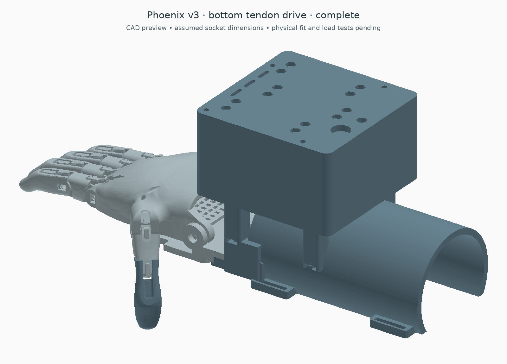

# Bottom tendon drive

This variant turns the **three motors and their drums upside down inside the enclosure**. The arm adapter, palm receiver and original Phoenix hand stay in the same position. The cords leave near the bottom of the box, outside the arm shell; they do not run against the residual limb.

The change is worth testing because it lowers the tendon exits and the lever acting on the box mount. It does **not** increase the motor's torque or change the drum's mechanical advantage.

[Drums viewed from below](exports/drive_detail_preview.png) · [Open box](exports/open_preview.png) · [Complete STEP](exports/complete.step) · [Geometry checks](exports/checks.json) · [Before/after schematic](exports/routing_comparison.png) · [Calculated comparison](exports/routing_comparison.json)

## What changes

- Motors point down, with their drums protected inside the case.
- A 4 mm upper cover carries the motor locating seats and mounting pillars. Four M3 bolts per motor pass through the servo ears into captive nuts in the cover. Ties are not the primary hanging restraint.
- The drawing-based ear-hole pattern is 49.5 × 10 mm. Actual screws, horn and ear fit still require a measured servo.
- The five tendon exits move from 42.4 / 48.5 mm above the box floor to 12.5 / 6.4 mm. This lowers individual exits by 29.9–42.1 mm.
- The box remains 94 × 96 × 54.9 mm. External fastener projections and cable bends are not included in those body dimensions.
- The lower arm adapter and its four M4 mounting points stay unchanged.

The load path is drum → servo case → ear bolts → structural cover → cover screws → case → M4 arm mounts. The cover and its fasteners therefore need load testing as structural parts.

The mechanism still has **three servos**: thumb; index/middle; ring/little. Each paired motor winds two independent cords in separate grooves. It gives fixed coupled travel, not an adaptive differential.

## What this does to force

Effective drum radius remains 12.3 mm. At the same motor torque, the ideal pull is unchanged: for equal paired cords, each tension is approximately torque divided by twice the radius. Ideal 160° take-up remains 34.35 mm.

Lower exits can make the external route less steep. Less sliding contact and less total bend can reduce losses, but merely shortening a free, straight cord does not increase pulling force. The final external route through the Phoenix hand has not been measured or validated, so **no percentage reduction in required motor torque is claimed**.

A flexible-line friction model illustrates why bends matter: the tension ratio depends exponentially on friction coefficient times total contact angle. For example only, reducing total sliding contact from 90° to 45° would reduce the required driving tension by about 4–15% for assumed coefficients 0.05–0.20. Neither those coefficients nor those angles have been established for this hand. [Engineering Statics: flexible-belt friction](https://engineeringstatics.org/Chapter_09-flexible-belt-friction.html)

For the earlier illustrative 10 N per hand tendon / 60% efficiency / five parallel exit cords, the box pitch reaction about its seating plane drops from 3.74 to about 0.84 Nm. That is a geometric internal-load comparison, not a wearer-joint torque, structural rating or measured efficiency improvement. Tendon forces also react at the palm. Reproduce with comparison.py.

## Parts and assembly

Use this folder's box_base and box_lid together. The cover is now a structural motor carrier; the old plain cover cannot support this arrangement. Other print types remain rear_board_carrier, two_groove_drum (two copies), thumb_drum, arm_adapter and palm_receiver: seven types, eight pieces.

The smaller FT5425BL replacement-servo candidate, Nano, SEN0240 and external power arrangement are retained from the [lower-box guide](../cuff_box_compact/README.md). This still does not identify the generic servos already owned. The original motor data and dimension drawing are in the [manufacturer specification](https://www.feetechrc.com/Data/feetechrc/upload/file/20210810/6376418710101296552903409.pdf).

The paired drums have only 1.8 mm nominal bare-flange clearance above the 4 mm floor. The M2 drum fasteners must project no more than **1.2 mm below the drum**, leaving just 0.6 mm nominal clearance. This tight allowance needs a measured horn/fastener stack and printed clearance check; ordinary projecting cap heads or nuts are not automatically compatible. Do not assume the earlier drum hardware fits. [Swept head-clearance check](exports/drum_hardware_checks.json)

Add twelve M3 motor-ear through-bolts and twelve nuts. Select lengths against the actual ear, printed pillar and nut engagement; the CAD's motor-head allowances are 6 mm diameter × 3 mm, not a purchased-fastener fit certificate. Inspect the small carrier ligaments, print orientation and hanging-motor retention on a bench. Retain the four cover fasteners, box-to-arm fasteners, board fasteners, horns and drum attachments described in the previous guide.

Assemble motors and horns on the removable upper cartridge. Install drums from below while the cartridge is out of the box. Thread and adjust the cords with the mechanism unpowered. For service, unload/slacken the cords and disconnect power before lifting the cartridge; do not lift the cover against tight finger tendons. Lead slack and the service movement are not fully modelled.

Because the motors are inverted, **do not assume the previous closing direction or endpoint settings remain correct**. Calibrate each motor with its cords disconnected. The existing software is unchanged; its setup positions must be checked against the new winding direction before loading. Keep cords in one layer and verify reliable reopening and a manual means of releasing tension.

## Acceptance boundary

The original generous full-height ear-envelope check is replaced here by the drawing-positioned ear shapes and holes because the new mounting pillars intentionally occupy space above those ears. Case, ear, drum, head and printed-part collisions are still checked.

The CAD checks cover the printed parts, reference components, mounting-ear/head allowances, straight internal cord segments, arm-space clearance and sampled hand poses. The view from below omits the housing deliberately to show the mechanism; the real drums remain enclosed.

Missing: measured external tendon routes, continuous moving-cord clearance, knots, horn fit, actual fastener insertion, service cable slack, motor duty/temperature, print strength and individual arm fit. The main reason to keep this variant is its lower routing and mounting lever; bench comparison must establish whether it actually pulls more efficiently.

Original hand geometry and attribution are retained. Mechanical CAD is CC BY 4.0. This is an unfitted bench prototype.
