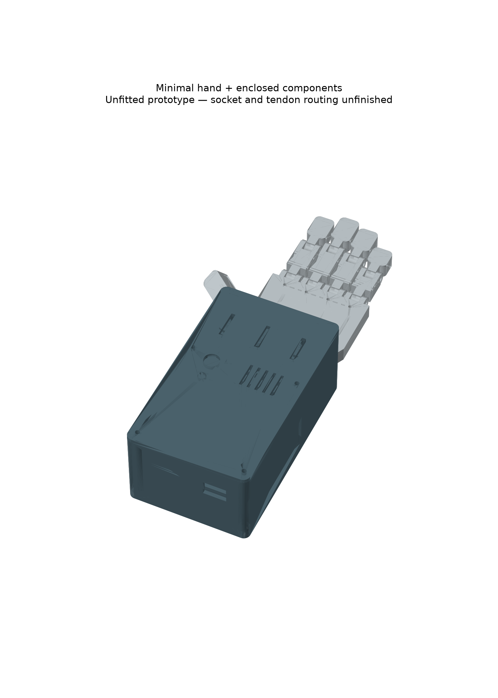
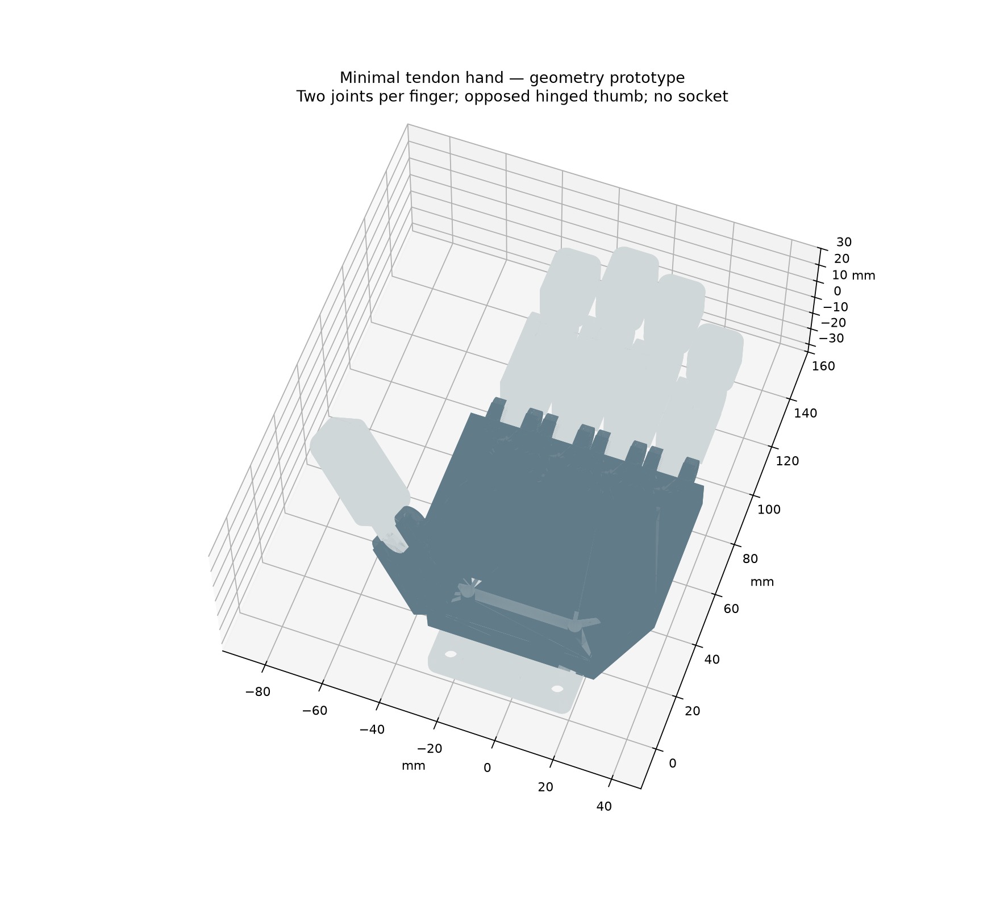
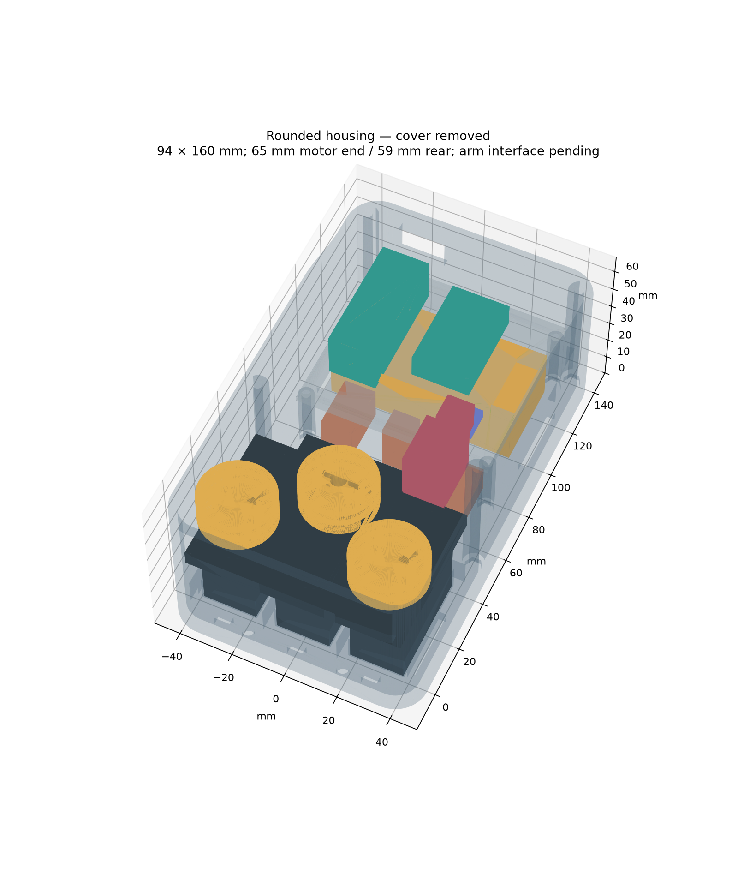

# Compact housing retained; custom hand superseded

**Use the [Phoenix v3 version](../phoenix_v3/README.md) for the current hand.** The housing, tray and lid here remain in use. The custom palm, finger, thumb and wrist-bridge files below are historical alternatives and are no longer the selected design. Their joint hardware list and motion checks do not apply to Phoenix.

## Earlier experimental revision C

An original CAD study of a tendon-driven hand with three actuators: thumb, index/middle and ring/little. This version replaces the Phoenix geometry with a simpler two-joint finger mechanism and a single-joint opposed thumb. It is a separate experimental branch of the design, not a verified upgrade to the Phoenix build.

**This is not yet fitted to a person.** The user intends attachment to an arm with a missing hand. Handedness, amputation level, residual-limb dimensions and an existing socket/connector have not been supplied. Both mirrored palm variants are exported. A skin-contact socket is deliberately absent; the wrist plate is only a prototype mechanical connection, not a standard prosthetic connector. Socket design and fit need an individual assessment by a prosthetist. [NHS prosthetic assessment](https://www.uhd.nhs.uk/hospitals-poole/services/157-services/poole/dorset-prosthetic-centre).

## Layout






The component housing is **94 mm wide × 160 mm long × 65 mm high**, excluding switches projecting through the lid, fastener heads, mounting hardware and the future socket. It is about 30% smaller in plan area than revision B, but taller because the spools are enclosed. This is a narrow rectangular prototype, not a claim of an optimally small or comfortable wearable package. Three full-size servos remain the main bulk constraint.

Three upright motors sit across the distal end. The middle spool is staggered longitudinally; all three use the earlier 12 mm-radius spool. The battery occupies the lower rear bay. A removable 2 mm tray holds the Nano, EMG signal board and logic regulator above it. The main regulator, fuse, capacitor and distribution occupy the lower forward bay. The dry electrode remains outside, on the residual limb, with its location determined during fitting.

The controller, signal board and regulator outlines follow the reference components listed in the root BOM. Servo bodies remain DS3225-sized references. The **24 × 54 × 6 mm servo-ear allowance is assumed**, not a measurement of the owned motors. Battery, switch, fuse and wiring-block envelopes are also assumptions. Added headers, plug insertion, actual horns, wire bends, tendon routes and service loops are not fully modelled. The compact layout therefore needs a physical packing trial before the full print.

## Mechanical hand

Four fingers each have two pinned joints. Index, middle, ring and little use proximal/distal lengths of 35/30, 40/32, 37/30 and 28/25 mm respectively; these are design choices, not measurements of the intended user. All fingers are nominally 16 mm wide. The thumb is a 45 mm hinged segment with fixed abduction and opposition angles in the palm bracket. Its palm-side clearance relief is included.

Flexor guide bores are 2.2 mm and sit below the hinge axes. Joint areas are open so the tendon can change direction as a finger bends. Short smooth guide inserts may be used in straight bores; do not bridge a hinge with rigid tubing. Distal cross-holes provide tendon anchors. Dorsal holes provide anchors for elastic reopening elements. Elastic routing, preload, tendon wear and hyperextension limits must be established on a single-finger fixture before connecting loaded servos. The CAD does not establish adequate mechanical end stops or a validated grasp.

Use the existing two floating equalisers for the paired groups. Position and restraint of these equalisers, and the transition from raised spools to palm guide bores, remain to be designed around measured cable bends and travel. Do not run tendons across a person's skin. This version is not a completed tendon-routing solution.

The wrist bridge has two M4 clearance holes per end on a 36 mm transverse pitch. It joins the hand to the component housing in the assembly study. Its load path, fastener pull-out resistance and compatibility with a real socket have not been tested. The eventual socket connection may require a different bracket or a different housing arrangement, particularly where residual-limb length leaves little space below the wrist.

## Files and reproduction

Run from the repository root:

```
python cad/build.py
python cad/compact/build.py
python cad/compact/hand.py
python cad/compact/assembly.py
```

Use CadQuery 2.8.0, trimesh and matplotlib. Scripts generate their own STEP, STL, previews and check reports. `build.py` contains the component envelope table; `hand.py` contains finger lengths and the palm/thumb geometry. Edit source dimensions and rerun checks rather than scaling the whole hand, because scaling also changes bolt and tendon-hole sizes.

Print one selected palm, four proximal links, four corresponding distal links, one thumb link, one wrist bridge, one base, one tray and one lid. Reuse three spools and two equalisers from revision B. STEP/STL part exports are moved to Z=0 for printing; the assembly STEP preserves their operating coordinates. The palm's tilted thumb mount will require slicer orientation/support review. Printed joint bores require fit checks and may need reaming. Never force a screw into a moving joint or tighten the cheeks onto the moving link.

## Hardware changes from the Phoenix build

This is a **replacement hand**, so do not buy the Phoenix pin/band set just for this version. The root BOM remains the revision B reference, not a complete price for this new design.

| Extra/replacement item | Initial quantity | Fit requirement |
| --- | ---: | --- |
| M3 joint bolts, washers and locknuts | 9 sets | Starting stock M3 × 25; verify shank, washers and clearance; avoid clamping joints |
| Elastic return elements | 9 | One per joint; dimensions/preload selected by testing |
| M4 wrist bridge fasteners | 4 sets | Two through hand + bridge, two through housing floor + bridge; select length after checking heads/nuts |
| M3 cover fasteners | 4 sets | 65 mm nominal stack; start with longer stock and trim/deburr to full nut engagement |
| M3 tray fasteners | 4 sets | 32 mm nominal stack to underside; verify nut engagement and non-protruding ends |
| Insulated mounting material | As needed | Nominal 1 mm above pads/tray; verify actual thickness |
| Soft battery strap | 1 | 10 mm wide, no compression of pouch cell |
| Tendon and smooth guide liners | Cut to fit | Route and measure on a bench before establishing stock lengths |

Retain the electronics, power protections, three metal servo horns and their M2 hardware from the reference BOM. Real socket/liner/attachment costs and parts cannot yet be specified.

## What is verified

- Generated printable parts must be single valid solids, with positive-volume watertight STL meshes.
- The packaging script checks all component/fixture pairs for volume clashes, including assumed servo ears and spools.
- The hand script checks the open assembly and sampled synchronized MCP/PIP poses at 0, 15, 30, 45 and 60 degrees for each finger against its neighbour link and palm. Thumb/palm samples use the same angles.
- These are sampled geometric checks, not full independent-joint swept-volume checks, structural tests, force tests or physical fit verification.
- The existing Nano firmware is unchanged. Its pulse limits are not calibrated for this hand; use disconnected motors and unloaded single-finger tests before changing them.

## Inspiration and provenance

The engineering references are [OpenBionics' whiffletree hand](https://github.com/OpenBionics/Prosthetic-Hands) and [Yale OpenHand's underactuated fingers and tendon differentials](https://www.eng.yale.edu/grablab/openhand/). The sources informed the approach of fewer actuators and passive adaptation. No geometry or code from those projects has been copied into this revision. The CAD scripts were generated with AI assistance under the project owner's direction. They are new prototype work and do not establish historical personal-statement claims. New geometry/source is CC BY 4.0 under the repository licence.
