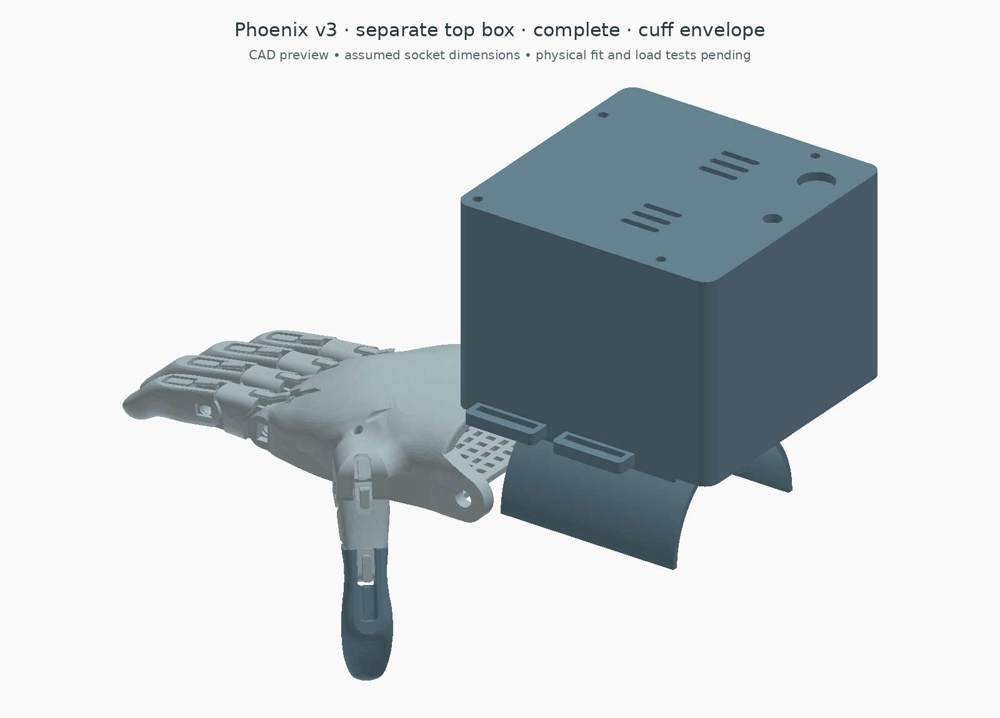

# Separate box above the Phoenix v3 cuff

This is a new enclosure design, separate from the integrated forearm version. It puts three servos, the Nano and the EMG signal board in a removable box above the original gauntlet. The original hand, finger shapes, joints, return bands and printed gauntlet are retained. No new holes in those parts are proposed.



[Mounting schematic](exports/mounting_schematic.png) · [Force worksheet](FORCES.md) · [Open view](exports/open_preview.png) · [Box by itself](exports/box_only_preview.png) · [Complete reference STEP](exports/complete.step) · [Box STEP](exports/box_only.step) · [Editable dimensions](profile.json) · [CAD checks](exports/checks.json)

The cuff in the assembled view is an **adjustable envelope**, not the exact original gauntlet after forming or a fitted socket. The hand and cuff are positioned for context; the original wrist-pin connection is not reconstructed in this view. The unchanged [flat source gauntlet](exports/original_flat_gauntlet_reference.step) is included separately. The official source is flat, and the [v3 assembly placemat](https://drive.google.com/file/d/1caT-qSH-01H-uLoA75pY2E4LHxce84tP/view) shows it heat-formed before assembly.

## What changes on the original hand

1. Keep the Phoenix palm, fingers, pins and return bands at their matching original scale.
2. Strap the padded enclosure feet above the formed gauntlet, using its existing strap-slot areas. Check the actual slots and formed contour before selecting the straps; no drilling is assumed.
3. Replace the wrist-driven tensioner function with the three servo drums. Reterminate the five finger cords at the drums while retaining the hand's existing tendon passages.
4. Route the dry electrode lead out of the box to its independently positioned forearm electrode. Only the signal-conditioning board goes inside the box.

The original tensioner mounting ridge can stay. The box floor is raised above the cuff crown to leave room for it. The source cuff is not cut or flattened to fit the enclosure.

**This is not yet a functioning wearable conversion.** Direct tendons react against the hand and cuff, so wrist stabilisation must be resolved before loading them. A free original wrist pivot can move instead of closing the fingers. For the previously specified missing-hand use, the original wrist-powered gauntlet also does not replace a fitted residual-limb socket and wrist connection. The [original v3 catalogue](https://hub.e-nable.org/s/e-nable-devices/wiki/208/e-nable-phoenix-hand-v3) describes its functional-wrist/palm requirements. Treat this as the removable actuator module for a supported bench assembly until those interfaces are settled.

## Layout

| Part | Position |
| --- | --- |
| Index/middle servo | Left, with a two-groove drum |
| Thumb servo | Centre, staggered rearward, with a one-groove drum |
| Ring/little servo | Right, with a two-groove drum |
| Nano | Upright at the rear; access USB with the lid removed |
| SEN0240 signal board | Upright beside the Nano |
| Separate logic regulator | Rear carrier, beside the sensor board |
| Power distribution allowance | Low down at the front |
| Main disconnect and arm switch | Lid, above the shorter rear boards |
| Battery and fuse | External; this keeps the enclosure short |

The box body is **94 × 96 × 71.5 mm** in the supplied example. Strap ears bring the overall width to 110 mm; the curved feet add height below the box floor. The motor footprint is 20 × 40.6 mm with a 40.5 mm body height. A larger 24 × 56 mm ear footprint is reserved above the low retaining walls.

These motor dimensions, shaft position and ear allowances are **assumptions for unidentified generic servos**, not confirmation that the user's motors fit. [profile.json](profile.json) exposes them. Measure the motors, horn, lead exit and connector before printing the final box. Changing a dimension reruns the packaging checks; the lid height follows the required motor/drum space and minimum electronics height.

The supplied cuff reference has a 32 mm outer radius and 3 mm padding allowance. The enclosure floor sits 10 mm above that nominal cuff crown. The two saddle rails follow the padded radius; the two strap stations are approximately Y=−63 and −30 mm relative to the hand's CAD wrist datum. Real thermoforming does not produce a perfect cylinder. This reference does not establish strap fit, pressure distribution, elbow clearance or retention under tendon load. The rear of the box overhangs the illustrated cuff by about 24 mm.

## Tendon drive

There are five independent cords. Each paired servo winds two cords in separate grooves at the same radius; the thumb servo winds one. This avoids a sliding equaliser cassette, but the two fingers in each pair have **fixed coupled take-up**. Adjusting the starting cord lengths can remove slack; it does not give independent adaptation when one finger contacts an object first. This version does not claim an adaptive grip.

The drum groove floor radius is 12 mm. With the illustrated 0.6 mm cord in one layer, the effective radius is 12.3 mm. An assumed 160° sweep gives **34.35 mm of ideal take-up**. Actual servo travel and required finger travel are unmeasured. Do not use a nominal 180° label as endpoint calibration.

For a paired motor, required spool torque is approximately `radius × (cord force 1 + cord force 2)`, before any additional transmission losses. For the thumb it is `radius × cord force`. Do not treat the advertised 25 kg·cm stall figure as usable continuous torque. A new measured-pull test is needed for this direct two-cord routing; the floating-equaliser test setup from the other design is not automatically equivalent.

The [force worksheet](FORCES.md) also calculates the mounting reaction. An illustrative 10 N per hand tendon with 60% routing efficiency produces about 5.59 Nm around the nominal cuff crown if all exit cords run parallel to the forearm. Two straps cannot simply be assumed adequate; this attachment needs a bench load test and a resolved wrist/socket interface.

Five front ports have 4.4 mm diameter × 4 mm deep liner seats, followed by 1.5 mm cord passages. The illustrated internal cords clear the case and other components in their straight routing. The external cords, knots, liner retention and moving wraps have not been validated. Keep winding to one layer and inspect return-band reopening, rubbing, uneven paired-finger loading and manual release before powered trials. Cutting servo power alone may not release a geared motor's grip.

## Printed parts

Use the files in this folder, not the older compact or integrated-forearm shells.

| Print | Quantity | Purpose |
| --- | ---: | --- |
| [box_base.stl](exports/box_base.stl) | 1 | Enclosure, curved feet, strap ears, motor seats and tendon ports |
| [box_lid.stl](exports/box_lid.stl) | 1 | Removable lid with switch holes and vents |
| [rear_board_carrier.stl](exports/rear_board_carrier.stl) | 1 | Upright Nano, EMG and regulator support |
| [two_groove_drum.stl](exports/two_groove_drum.stl) | 2 | Paired-finger drives |
| [thumb_drum.stl](exports/thumb_drum.stl) | 1 | Thumb drive |

That is five new print types, six printed pieces. Matching STEP files are alongside the STLs. Print files have minimum Z=0; assembly offsets are recorded in `checks.json`. The complete STEP contains reference components and is not a print-in-place model. Review slicing and supports, particularly the curved feet, horizontal passages and upright board carrier.

## Hardware and electrical notes

| Item | Quantity / requirement |
| --- | --- |
| Servos | 3 measured positional servos; owned model and voltage still unknown |
| Matching metal horns and centre screws | 3 sets; do not print a guessed servo spline |
| Horn-to-drum fasteners | 6 M2 sets fitting the 2.3 × 5 mm slots; verify hole spacing, engagement and underside clearance |
| Servo retaining ties | 6, up to 4.8 mm wide; two per motor through the base slots; keep buckles inside the box |
| Box straps | 2; box slots are 3 × 22 mm, original cuff slots must be checked; 15 mm webbing is a starting size allowance |
| Padding | Nominal 3 mm under the saddle rails; fitted contour and retention still need assessment |
| Lid fasteners | 4 M3 through-bolt/nut sets; length selected against the print, with screw tips kept clear of the cuff |
| Carrier fasteners | 2 M3 sets; check the 6.6 mm corner-to-corner nut pockets and engagement |
| Board ties/insulating pads | As needed for the three boards; slots avoid assuming PCB mounting-hole patterns |
| Short tendon liners | 5; seats allow 4 mm OD stock, but select ID and retention to suit the actual cord |
| Classic 5 V Nano, SEN0240, separate 5 V logic regulator | 1 each; component blocks are clearance references, not exact connector models |
| Main disconnect, arm switch, wiring and grommets | Measure actual bodies and ratings; the lid holes are 12.2 and 6.2 mm |
| External motor supply, fuse and suitable connector | Select together after identifying the servos and measuring current; no battery is inside this enclosure |

The existing firmware mapping remains D9=thumb, D10=index/middle, D11=ring/little, A0=EMG and D2=arm switch. See [firmware setup](../../firmware/README.md). Recalibrate all endpoints with tendons disconnected and then with the new routing. Servo power must come from its correctly rated supply, not the Nano's 5 V output. Motor voltage is deliberately unspecified here because the generic units remain unidentified.

The lid switch blocks and the horn-height gap are space allowances. Shaft/drum concentricity is checked, but this does not establish spline engagement, horn shape, bolt access, plug clearance or a complete electrical assembly. The slots and vents are not a water/sweat protection rating.

## Rebuild and validation

```sh
python cad/cuff_box/build_box.py
python cad/cuff_box/build_box.py --profile my_box_profile.json --output /tmp/my-cuff-box
```

The generator checks valid single solids and watertight positive-volume meshes for the five print types; static component/cord intersections; the larger servo-ear keep-outs; clearance from the nominal cuff volume; three finger/thumb poses against the new box; and placement matches after STEP export. It recovers shaft and drum axes from cylindrical faces. Source/profile/output hashes are saved in `exports/checks.json`.

These are discrete geometry checks, not proof of continuous tendon motion, safe attachment, heat/current performance, print strength or fitted use. The hand's source geometry and corrected fingertip poses come from the existing verified Phoenix assembly. No original geometry is drilled or cut.

Original Phoenix v3 geometry remains credited to its designers in the repository's [attribution and licence notes](../phoenix_v3/README.md#attribution-and-licence). This new mechanical design is CC BY 4.0. Earlier integrated-forearm and resized-receiver variants remain separate designs.
