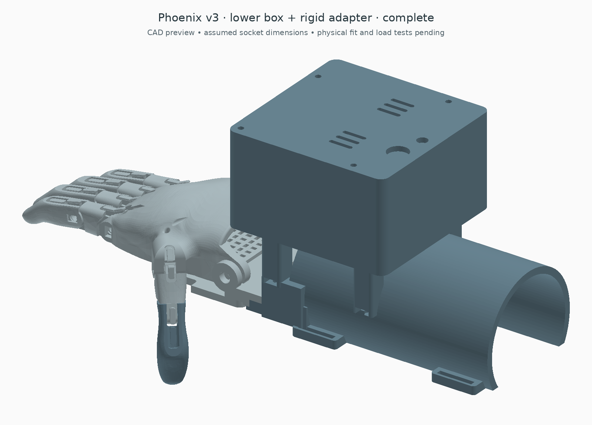

# Lower box and rigid arm adapter

This version makes the preceding cuff box smaller and adds a physical connection between the motor box, arm carrier and unchanged Phoenix palm. It is an **unfitted bench prototype**, not a finished socket.

[Inside the box](exports/open_preview.png) · [Complete STEP](exports/complete.step) · [Editable profile](profile.json) · [Geometry report](exports/checks.json)

## Size and motors

The box body is **94 × 96 × 54.9 mm**, down from 94 × 96 × 71.5 mm: **23.2% less height and bounding-box volume**. The old strap ears are removed, so maximum box width falls from 110 to 94 mm. The box underside moves down from global Z=50 to 44 mm. These comparisons apply to the enclosure, not the complete hand and new arm adapter.

There are **three motors total**:

| Motor | Fingers pulled | Drum |
| --- | --- | --- |
| D9 | Thumb | One groove |
| D10 | Index and middle | Two separate grooves |
| D11 | Ring and little | Two separate grooves |

Each paired motor pulls two individually adjusted cords. Both wind at the same radius and move together; this is not an adaptive differential. If one finger stops against an object, the other cannot automatically continue independently. Test this explicitly before grip trials.

The smaller case uses **FT5425BL replacement servos**, with the manufacturer's 40.6 × 20 × 30 mm case reference and 11.5 mm shaft offset. It does **not** establish that the unidentified motors already owned will fit. Ear width is conservatively reserved at 24 mm. Horn shape, cable exits and assembly clearances remain sample-dependent. [Manufacturer specification](https://www.feetechrc.com/Data/feetechrc/upload/file/20210810/6376418710101296552903409.pdf)

The Nano is turned sideways on the rear carrier. The SEN0240 signal board stays upright beside it. The battery remains external. Two-groove drums are 7.2 mm high; the thumb drum is 4.2 mm. Both retain the 12 mm groove-floor radius, with 1.2 mm flanges and 1.8 mm clear groove width. With 0.6 mm cord, nominal effective radius stays 12.3 mm and ideal 160° take-up stays 34.35 mm. Verify one-layer winding, knots and reopening in practice.

## Arm adapter and wrist

The new open carrier replaces the old cylindrical cuff illustration. It is an exported, printable part with:

- Four M4 attachment posts for the box, spaced 56 mm along the arm; countersunk seats keep the box floor flush under the motors.
- Side-entry captive-nut pockets, so mounting nuts can be inserted from outside.
- A distal bridge with two M4 attachment points for the palm receiver.
- A receiver using the existing Phoenix wrist bores, an under-palm support, a palm retention-strap path and two adjustable M4 stop/pad locations.
- Two arm-strap stations 85 mm apart, with 3 × 21 mm slots for nominal 20 mm webbing.
- An open underside between the straps for separate positioning of the dry electrode.

The hand, fingers and native thumb joint are unchanged. The new carrier replaces the original wrist-powered gauntlet. The wrist axle alone remains a hinge: the under-palm stop pads **and** palm retention strap must be fitted and tested to restrain rotation. Neither the palm strap, padding, stop heights nor axle retainers are validated by the CAD checks.

Default carrier inner radius is 32 mm, wall 4 mm, centre Z=8 mm. Its curved section runs Y=−160 to −38 mm; reserved clear limb volume ends at Y=−44 mm, before the distal bridge. A nominal 3 mm liner would leave 58 mm inner diameter. These are editable fixture dimensions, not anatomical measurements or a fitting range. The carrier does not provide a validated suspension system, tissue-pressure distribution or elbow clearance.

The electrode remains on an independent band against exposed skin, aligned with the relevant muscle direction; it is not buried behind the printed shell. DFRobot lists a 22 × 35 mm dry-electrode board. The existing carrier can be a fit-check starting point, but actual contact protrusion and comfort require measurement. [DFRobot sensor and placement information](https://wiki.dfrobot.com/sen0240/)

## Print and hardware selection

Use these files together; do not combine this box with the preceding strap-on base.

| Printed part | Quantity |
| --- | ---: |
| box_base | 1 |
| box_lid | 1 |
| rear_board_carrier | 1 |
| two_groove_drum | 2 |
| thumb_drum | 1 |
| arm_adapter | 1 |
| palm_receiver | 1 |

Seven print types, eight pieces. Each has matching STEP/STL exports at print Z=0. Assembly coordinates are recorded in the report. Review supports for horizontal passages and curved surfaces before printing.

Hardware: three matching metal servo horns/centre screws; six M2 horn-to-drum fasteners; six servo retaining ties; four M3 lid sets; two M3 board-carrier sets; four M4 countersunk box-to-adapter sets; two M4 receiver-to-adapter sets; two M4 stop screws with broad retained pads; matching wrist axle and retainers; two arm straps and one palm strap; padding; five retained short tendon liners. Verify all lengths against the print. Do not print a guessed servo spline. Slotted drum attachment is not proof of a particular horn fit.

Electronics: three FT5425BL candidate servos, classic Nano, SEN0240, separate regulated 5 V logic supply, suitably rated external motor supply, fuse, disconnect, distribution, wiring and grommets. Exact high-current components and prices remain unselected. The prior generic-servo 5 V power arrangement must not be reused unquestioningly.

At the manufacturer's evaluated 6 / 7.4 / 8.4 V points, three simultaneous stalls are 10.2 / 13.2 / 15 A. The existing candidate force screen gives 10.84 / 13.23 / 15.15 N per paired hand tendon with its explicit 60% efficiency and 1.5 margin assumptions. These are not continuous-duty or fingertip-force claims. [Calculation and power requirements](../slim/README.md#force-screen)

Firmware is unchanged: D9 thumb, D10 index/middle, D11 ring/little, A0 EMG, D2 arm. Calibrate endpoints with cords disconnected before loading. Bench-test release and provide a way to slacken the tendons manually; removing power may leave a geared motor holding its position.

## Mounting-load calculation

For an illustrative 10 N at each hand tendon and 60% routing efficiency, each paired motor requires 0.410 Nm and the thumb requires 0.205 Nm, before a separate design margin. The new box reaction about its seating plane is 3.74 Nm if all five exit cords run parallel to the forearm. The equivalent couple across its 56 mm mounting span is 66.7 N. This is a load case for the frame, not a bolt or strap rating. The old box calculation was 5.59 Nm about the cuff crown; lowering the exit height reduces this geometric lever by about 33%.

Tendon forces also react at the palm: these internal box moments are **not** the net torque applied to the wearer. The rigid bridge must carry both sides of that load path. [Reproducible load scenarios](exports/load_checks.json) are generated by the included load_check.py script.

## Verification and remaining work

The generator checks solids and meshes, internal reference-component/cord clearance, servo-ear envelopes, the adapter/receiver interface, reserved limb space, 13 sampled hand poses and exported assembly placement. These tests do not establish continuous tendon motion, print strength, measured hardware fit, mounting stiffness or safe worn use.

Six nominal mounting-screw shank/head allowances also clear the exported printed parts; see [mount checks](exports/mount_checks.json). This does not establish actual screw length, nut fit or tool access.

Build from the repository root with CadQuery 2.8, trimesh, numpy and matplotlib:

    python cad/cuff_box_compact/build_box.py

Identify and measure hardware, establish tendon loads, fit the wrist stops/retention, then test the assembly on a rigid fixture. A prosthetist or appropriate limb-fitting professional still needs to determine the residual-limb interface and suspension before powered wear.

Original Phoenix attribution and CC BY 4.0 notices remain in the repository. New mechanical work is CC BY 4.0.
