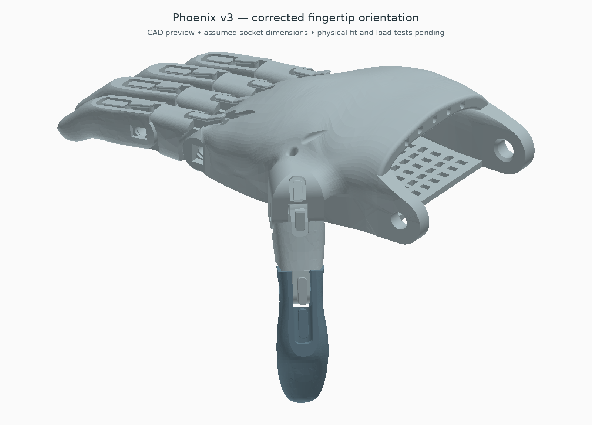

# Forearm-integrated Phoenix — 0.4.3 design candidate

This replaces the separate box mounted above the arm. Three servos, battery, Nano, EMG conditioner and tendon mechanism sit inside a split forearm shell. The original Phoenix v3 palm and finger shapes are retained. This is an unfitted bench-development design, not a working or wearable prosthesis.


## Update in 0.4.3

The complete and close-up exports are now checked against the same eleven original hand solids, so stale fingertip placement cannot silently return. Preview and assembly hashes are checked during packaging. Thirteen simultaneous five-digit closure samples pass the documented collision threshold; [view a sampled flexion pose](exports/flexion_preview.png). These samples include the palm, other fingers, thumb, wrist support and both forearm halves. They do not simulate tendon forces or establish a continuous swept clearance.

The motor reference now follows the FT5425BL drawing: the shaft is offset 11.5 mm along the case, and each spool is centred on that axis. The shaft and slotted mounting ears are represented in CAD. No printed forearm dimensions changed. The actual motor, horn, screws and cables still require fitting. `servo_axis_checks.json` independently recovers the shaft and drum axes from the exported STEP and confirms that all three coincide. The nominal 0.1 mm shaft-top-to-spool-base gap does not establish a usable metal-horn connection.

## Hand correction

The layout is now checked against the **original Phoenix v3 right-hand placemat and STEP**, rather than inferred from the older v2 guide. The four distal parts remain **short index, long middle, long ring, short little**, with dorsal return-band features on the same side as the palm's return-band tabs.

The thumb now attaches at the **original palm hinge**. The extra side fork and its outrigger plate are removed. The hinge centre is recovered from the actual inner bearing faces, including the asymmetric shoulder: the clear gap is 6.5 mm. The displayed thumb is rotated 60° toward the palmar side about that original axis; this is a checked CAD pose, not a measured anatomical angle or a manufacturer-prescribed stop. Placing it flat in the palm plane caused interference. A small scallop in the added wrist support clears the sampled thumb motion, and its left strap slot moves inboard. No original palm or finger surfaces are cut.



Sources: [official v3 catalogue](https://hub.e-nable.org/s/e-nable-devices/wiki/208/e-nable-phoenix-hand-v3), [right-hand placemat, both pages](https://drive.google.com/file/d/1caT-qSH-01H-uLoA75pY2E4LHxce84tP/view), and [original STEP](https://drive.google.com/file/d/1qt4fIh77aN9F0LTXMMZCiVgzgbxBcUQ3/view). The original Fusion archive was also retrieved and its embedded preview inspected; it was not opened as a native parametric assembly. See `source_review.json` for hashes and scope. The placemat is linked rather than redistributed.

**Fingertip correction in 0.4.2:** the upstream STEP is a printing layout, and all five distal parts are dorsal-side down relative to the proximal parts. They must roll 180° about their length before assembly. Earlier previews left them inverted; the visible tab at each PIP belonged to the proximal part, which concealed the error. The corrected fingertips put their own return-band tabs dorsally and their pads toward the palm. Original surfaces remain unchanged.

The displayed PIP/thumb-tip rest bend is 10°. With the corrected roll, a perfectly straight 0° pose overlaps the original extension-stop surfaces (about 2.66–3.41 mm³ for the four fingers); 10° clears them. This is a CAD rest setting, not a measured physical stop angle. `hand.py` records 40 adjacent-part checks through 60° MCP/PIP bends, all below the 0.001 mm³ reporting threshold (maximum approximately 0.000895 mm³). The previous larger 30–60° overlaps arose from the inverted fingertips; they are not evidence of a defect in the source design. The 45° MCP / 15° PIP assembly illustration also passes its checks. Pins, tendons, return bands, continuous motion and loaded closure still require validation.

## Inside the arm


| Location | Parts and provision |
| --- | --- |
| Distal forearm, dorsal level | Three low-profile FT5425BL reference servos on an integral shelf, with low retaining walls and tie slots |
| Below motors | 70 × 32 × 22 mm battery allowance in a cradle; two 10 mm strap tunnels |
| Forward, below tendon mechanism | Removable Nano/EMG tray, separate 5 V regulator, fuse and distribution allowances |
| Forward, upper level | Two covered equaliser lanes and a separate lower thumb slider lane; five tendon exits |
| Upper shell | Recessed main disconnect and arm-switch positions |
| Socket underside | Window for an independently strapped SEN0240 electrode carrier, aligned with the placeholder socket taper |
| Socket side seam | Cable passage from the electrode area toward the equipment bay |


Green blocks are the Nano and EMG conditioner; gold is the battery; dark blocks are motors and electrical allowances. These envelopes do not include complete wiring, plugs, horns, straps or every fastener. Servo body and mounting-ear dimensions now follow the manufacturer drawing rather than the former ear allowance; rounded body details remain simplified. The electrode has an assumed 6 mm thickness; contact protrusion, liner clearance and muscle location still need measurement.

The shell is approximately **102 mm wide × 102 mm deep at its largest section**, including seam bosses. Its curved body is 279 mm long; the proximal opening to the hand's wrist datum is 295 mm. These dimensions describe the forearm, not the total spread hand. The three motors occupy different longitudinal positions so their spools do not overlap. The shell wraps this equipment instead of carrying a separate roof box.

Compared in the same CAD axes, maximum assembly depth falls from **145 to 110.4 mm**, about **24% less**. This uses more length: the full assembly's longitudinal bounds increase from about 317 to 432 mm because the equipment is beyond the limb end rather than stacked above it. It is a packaging trade-off, not a 24% volume reduction or proof of anatomical fit. `envelope_comparison.json` records both exported assemblies; regenerate with `python cad/forearm/compare.py`.

## The space requirement that must be checked

The model reserves an empty socket from Y = −295 to −160 mm: **135 mm of socket length**, with nominal inner elliptical diameters of about 70 × 64 mm proximally and 54 × 50 mm distally. These are geometric placeholders, not measured anatomy or a liner specification.

It then assumes **160 mm from the residual-limb end to the wrist datum**. The equipment bay begins beyond the limb end, separated by a 3 mm bulkhead. No modelled equipment occupies the reserved limb volume. If the recipient has less distal space, this arrangement would make the arm too long: it must be repackaged around measured anatomy or use substantially different actuators. Do not shorten the socket or put components into occupied limb space to force a fit. Suspension, pressure distribution and alignment require individual fitting.

## Selected parts and hardware

Print-coordinate STEP/STL pairs are in `exports/`. Their minimum Z is zero; assembly positions are recorded in `checks.json`. `complete_forearm.step` is the assembly reference, not a print-in-place object.

| Added print | Quantity |
| --- | ---: |
| `forearm_lower`, with servo shelf and battery cradle | 1 |
| `forearm_upper`, with recessed controls | 1 |
| `electronics_tray` | 1 |
| `internal_tendon_base`, `internal_tendon_cover` | 1 each |
| `thumb_slider` | 1 |
| `palm_receiver`, with native-thumb clearance | 1 |
| `../compact/exports/single_groove_spool.stl` | 3 |
| `../exports/pair_equaliser.stl` | 2 |
| `../arm_interface/exports/emg_band_carrier.stl` | 1 |

Use the original right Phoenix hand/pins at the selected scale from the [official release](https://www.thingiverse.com/thing:4056253). Some source STEP-to-STL conversions failed earlier mesh checks, so the source hand's diagnostic meshes are not offered as accepted printable files. The source hand is included in the assembly STEP. Do not scale the whole motorised assembly: hardware dimensions would change.

Additional hardware allowance: ten M3 through-fastener sets for the shell seam; four for the electronics tray; four for the tendon base; two for its cover; two M4 sets at the forearm/receiver interface; and two M4 palm-support positions. Access and engagement lengths need to be selected against a print. The tendon cover captures two top-loaded M3 nuts in 6.6 mm corner-to-corner hex pockets, 2.4 mm deep. M3 × 6 mm cover screws are the starting allowance: check nut fit and engagement, and keep their tips above Z = 11 mm so they do not obstruct the lower thumb lane. These pockets provide metal threads; the printed clearance bores are not threads. The tendon-base motion check includes 6 mm diameter × 2 mm high screw-head allowances at X = ±30 mm, in 6.4 mm access pockets. Shell seam bosses have only about 1.3 mm radial wall around the bore and require a strength/print check.

Retain the original wrist axle/retainers, the original E thumb-knuckle pin, checked for fit, three matching metal servo horns and their retaining screws, six M2 horn/spool fasteners, servo ties, two socket straps, a separate electrode band, palm-retention strap, battery straps, insulating board pads, tendon, return bands and liner stock. Battery straps must fit the nominal 1 mm gap below the servo shelf (maximum 0.8 mm strap allowance). These counts specify CAD provisions; they do not establish load-rated attachment or a complete priced shopping kit.

## Electronics, pull and travel

The replacement-parts [electrical BOM and force model](../slim/README.md#replacement-bom-and-power-changes) apply: three FT5425BL candidates, classic 5 V Nano with low soldered connections, SEN0240 and separate 5 V logic regulator. A protected 2S rail feeds these particular servos directly. The owned generic servos are unidentified and are not approved for that rail.

At the retained 12.3 mm effective spool radius, the screening model gives about **10.8 / 13.2 / 15.1 N per paired tendon at 6.0 / 7.4 / 8.4 V**, using the lower of manufacturer rated torque and 40% stall torque, 60% assumed routing efficiency and a separate 1.5 margin. This is tendon pull, not fingertip force or continuous-duty approval. [Manufacturer data](https://www.feetechrc.com/Data/feetechrc/upload/file/20210810/6376418710101296552903409.pdf); generated values: `../slim/forces.json`.

The [measured-pull checker](../../calculations/MEASURED-PULL.md) accepts real actuator-end forces and travels without counting routing friction twice. Empty readings cannot produce a pass.

The new routing has not been measured. Longer bends and liners can reduce efficiency; repeat the [full-path tendon test](../../TENDON-TEST.md) before accepting these figures. Ideal take-up at 160° is 34.35 mm, within the 38 mm sampled slider range, but required hand closure travel remains unmeasured. The potential combined stall demand reaches 15 A at 8.4 V. Select the actual protected pack, disconnect, fuse, wire and connectors together; the earlier 10 A parts and 7.5 A fuse are not an accepted substitute. The CAD still contains reference volumes for those unselected components.

The existing [Nano firmware](../../firmware/README.md) is unchanged: smoothing, one EMG input and three linked servo commands. Calibrate each new servo with tendons disconnected. There is no active force/current feedback. The old generic-servo 5 V power diagram is historical; use the candidate topology in the linked electrical guide.

## Checks and rebuild

`checks.json`: seven valid single-solid added parts; watertight positive-volume STLs; no modelled static component/part overlaps above 0.001 mm³; no equipment intrusion into the reserved socket. `motion_checks.json`: both shell halves also clear that socket; 18 equaliser poses (three positions × three angles × two bars) and three thumb-slider positions clear the fixed geometry and sampled fastener heads. This is a set of discrete tests, not a continuous sweep. `layout_checks.json` records eight thumb samples: root angles −60°, −70°, −80°, −90°, each with 10° and 30° tip flexion. These clear the palm, thumb parts and revised support. Full opposition, pin fits, moving tendons and return bands remain unaccepted.

With CadQuery 2.8.0, trimesh, numpy, matplotlib and Pillow:

```sh
python cad/forearm/hand.py --check-motion
python cad/forearm/verify_layout.py
python cad/forearm/build.py
python cad/forearm/verify_motion.py
python cad/forearm/verify_closure.py
python cad/forearm/verify_servo_axes.py
python cad/forearm/previews.py
python cad/forearm/package.py
```

The hand diagnostic checks discrete poses with the corrected fingertip roll. It is not a continuous or loaded-motion test. Mechanical fit, cable bends, manual release, palm restraint, structural strength, EMG/motor-noise performance, battery protection and heat under load remain bench acceptance work. No hardware was assembled, powered or fitted for this revision.
