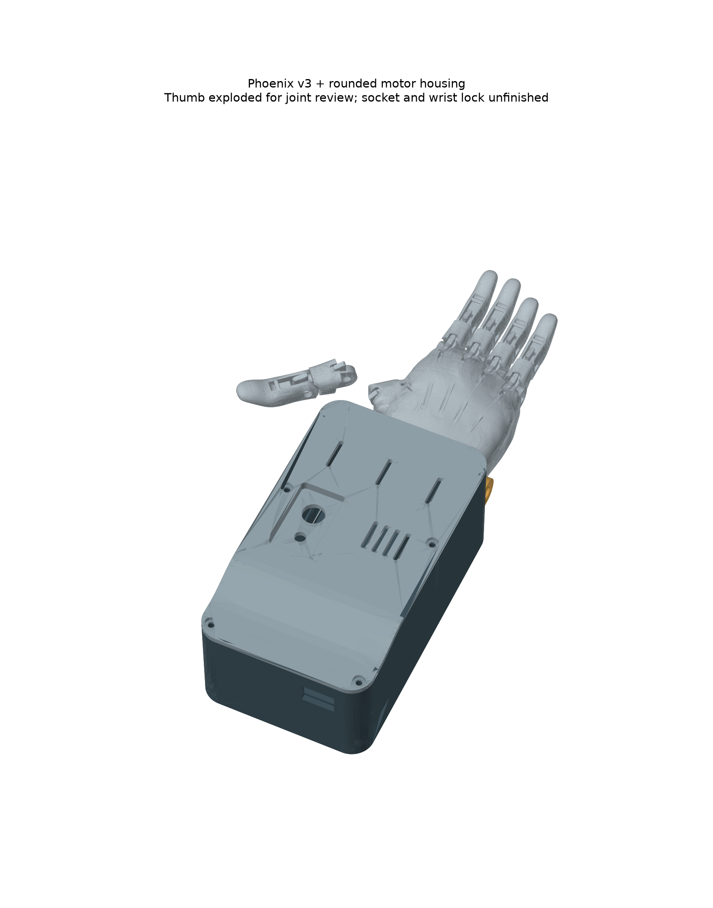

# Current design: motorised e-NABLE Phoenix Hand v3

**Historical layout:** [0.4.0 forearm integration](../forearm/README.md) is the current candidate. It corrects the index/ring distal-part assignment and open thumb placement shown in older assembly previews. Only reuse files explicitly selected by that guide.


This is the requested Phoenix-based version. The palm, finger sections, tendon passages and original joint geometry come from the **official e-NABLE Phoenix Hand v3 STEP file**. The custom hand introduced in the previous study is superseded. The compact three-servo housing remains as the electronics/actuator module.



## What is retained and what changes

| Retained from Phoenix v3 | Added for motorisation |
| --- | --- |
| Original left and right palms | Compact three-servo housing, electronics tray and lid |
| Original five proximal and five distal sections | Three single-groove servo spools and two paired-finger equalisers |
| Original finger joints, pin geometry and tendon passages | A trial wrist cradle using the existing palm pivot bores |
| Original return-element approach | Arduino Nano, SEN0240 signal board, power electronics and battery |

No holes have been drilled in the source palm and no original finger shapes have been replaced. The exported source parts retain their original dimensions and coordinates. The reference assembly translates/rotates those bodies into a hand pose; it is not a print-in-place assembly. The thumb is shown exploded, 22 mm laterally and 12 mm upward, because its oblique joint orientation has not yet been verified. This display offset is not a proposed mechanical connection.

The intended actuation remains one servo for the thumb, one for index/middle and one for ring/little. The wrist-powered tensioner is not the intended motorised tendon drive. Original tensioner parts and arm guard are included for traceability, not as a requirement to print every source part.

## Wrist cradle and enclosure

`phoenix_wrist_cradle` is new geometry. Its coaxial 6.4 mm clearance holes reference the original palm's nominal 6 mm wrist bores. It bolts to the compact housing using two M4 clearance holes on a 36 mm transverse pitch. The housing is raised 4 mm onto the cradle's rear plate in the assembly.

The cradle is a **pivot-alignment prototype**, not a finished wrist connector. It still requires a retained axle, neutral-position lock/stops, strength checks and adaptation to the selected hand scale. The pivot must not remain free under loaded tendons. Do not substitute the original short wrist pins without checking their engagement in the wider cradle. The complete motorised wrist load path is not validated.

The rounded enclosure retains a 94 × 160 mm footprint and 60 mm maximum height at the motors. The roof falls smoothly to 57 mm at the rear, with 12 mm outer corner radii, recessed switch controls and recessed cover screws. The 6.75 mm-high spools retain the 12 mm groove-floor radius while removing the unused second groove. Print these from `cad/compact/exports`, not the older two-groove part. The lid requires slicer support/orientation review. See [component dimensions and assumptions](../compact/README.md). Its reference motor ears, battery and switches are not measurements of the user's parts. Board, connector and cable fit still require physical checks.

## Arm fit

The original Phoenix v3 is a wrist-powered design intended for someone with a functional wrist and sufficient palm to operate it. That requirement is documented by [e-NABLE](https://hub.e-nable.org/p/devices?p=e-NABLE+Phoenix+Hand+v3). Motorising the fingers does not make the original palm and arm guard a fitted socket for someone with a missing hand.

For this user's intended missing-hand application, a suitable individual socket and wrist connection remain necessary. Right side and a residual forearm are now specified. Available length, limb shape and socket/interface dimensions are still unknown. An [open saddle and movable electrode-holder concept](../arm_interface/README.md) is now provided with placeholder dimensions; it is not a fitted socket. The pictured right-hand arrangement is only a reference; both original palms are exported. Do not use the source scale as a recipient fit prescription.

## Files

- `exports/original_palm_left` and `original_palm_right`: original palm STEP files.
- `exports/proximal_*`, `distal_*`: original finger sections. Lettered duplicate sections are indexed by source solid, not a new sizing system.
- `exports/original_pin_or_spacer_*`: original labelled-pin/spacer geometry, without invented pin-to-joint assignments. Follow the official assembly guide.
- `exports/original_arm_guard` and `original_tensioner_part_*`: retained reference parts.
- `exports/phoenix_wrist_cradle`: new printable/editable cradle prototype.
- `exports/phoenix_motorised_reference.step`: positioned source hand, cradle and component housing; reference only.
- `checks.json`: source-body mapping, source hash, mesh checks and static assembly collision results.

Use the official [right-hand assembly placemat](https://drive.google.com/file/d/1caT-qSH-01H-uLoA75pY2E4LHxce84tP/view) or [left-hand assembly placemat](https://drive.google.com/file/d/1caYKGoE5w9RL3n52ls-7htutYQ34OLoD/view) for the Phoenix pins and physical assembly. The CAD pose does not prove pin insertion access, range of motion or correct return-band tension.

**For printing the original hand, use the [official Phoenix v3 STL release](https://www.thingiverse.com/thing:4056253).** Trial STEP-to-STL conversion produced non-watertight meshes for some source bodies. Those converted source STLs are withheld; the source STEP geometry remains intact. Only the new cradle STL is included here. `checks.json` retains the diagnostic conversion results rather than claiming that every source mesh passed.

## Reproduce and verify

```
python cad/build.py
python cad/compact/build.py
python cad/phoenix_v3/build.py
```

CadQuery 2.8.0, trimesh, numpy and matplotlib are used. The script verifies the upstream file hash before extracting its 32 solids. New cradle checks and source-body mesh results are recorded separately. Static contacts below 0.001 mm³ are recorded separately; larger overlaps cause the script to fail. The deliberately exploded thumb is excluded from any claim of joint fit. Static overlap checks do not replace full articulation, tendon routing, fit, load or thermal testing. The old custom-hand motion checks do not apply to Phoenix.

Before a complete print: choose the Phoenix scale, check one original joint and one cradle pivot fit, select actual axle/retention hardware, complete the wrist lock and tendon/equaliser routing, and recalibrate servo endpoints on a bench. The firmware's current small test movement remains unchanged.

## Attribution and licence

Phoenix Hand v3 by Jason Bryant, John Diamond, Scott Darrow, Andreas Bastian, Team Unlimbited, e-NABLE France and Jeremy Simon, based on Phoenix v2 and Unlimbited Phoenix. Official source: [e-NABLE catalogue](https://hub.e-nable.org/p/devices?p=e-NABLE+Phoenix+Hand+v3), linking to the [STEP download](https://drive.google.com/file/d/1qt4fIh77aN9F0LTXMMZCiVgzgbxBcUQ3/view) and [Thingiverse release](https://www.thingiverse.com/thing:4056253).

Original and new mechanical CAD are CC BY 4.0. Source geometry is retained; new work comprises packaging, cradle and reference assembly placement. No endorsement is implied. Generated CAD and calculations remain prototype work produced with AI assistance under the project owner's direction.
