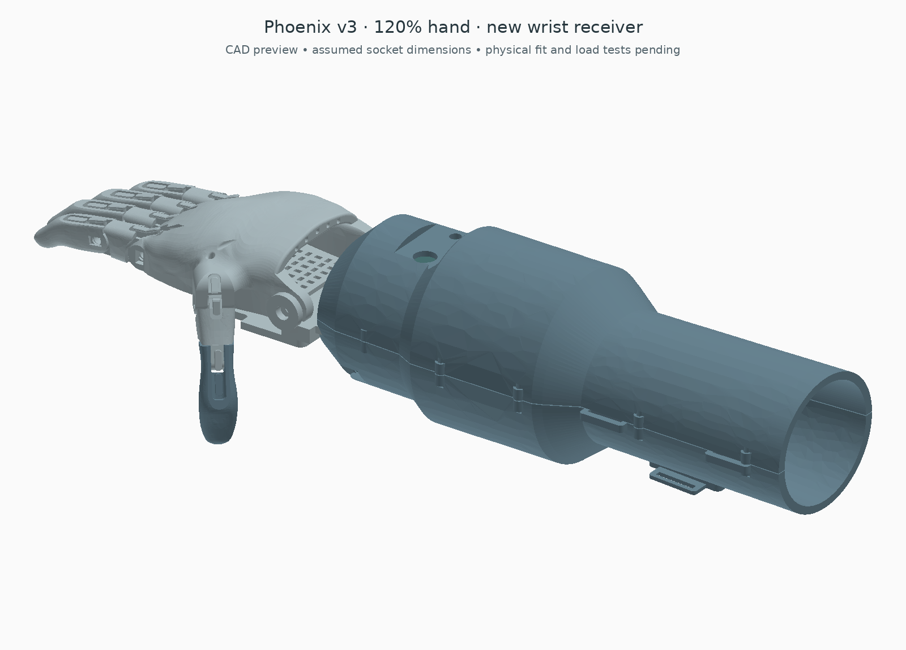

# Resized wrist receiver — 120% design example

This adds a physical CAD receiver between the resized Phoenix hand and the existing forearm. It uses the same [editable profile](profile.json) as the sizing study. The current example is 120% of the source hand, not a size selected for a wearer.



[Complete STEP](adapter_exports/sized_complete.step) · [Open assembly](adapter_exports/sized_open_preview.png) · [Flexion sample](adapter_exports/sized_flexion_preview.png) · [Receiver STEP](adapter_exports/resized_receiver.step) · [Receiver STL](adapter_exports/resized_receiver.stl) · [Revised lower shell STL](adapter_exports/forearm_lower_head_clearance.stl) · [Check report](adapter_exports/adapter_checks.json)

## Interface changes

The two forearm attachment holes stay at X=±18 mm, Y=−24 mm. Their 4.4 mm clearance bores, the mounting plane and the centre passage for the thumb mechanism stay full size. The receiver widens only beyond the forearm nose, so the larger hand does not push its supports into the shell.

The hand-facing wrist bores follow the source hand scale. At 120% they are 7.6 mm in diameter: the original 6 mm palm bore scales to 7.2 mm, with 0.4 mm diametral clearance added in the receiver. The original wrist axis lies at Y=0, Z≈9.60 mm at this scale. The new ears remain 4 mm thick, and their outer span is 88 mm. These are CAD dimensions; measure and select the actual axle and retainers. Do not assume the earlier wrist pin is long enough.

The underside plate remains 4 mm thick. It has fixed-size strap slots for a nominal 20 mm strap and M4 support positions that move with the palm. The native thumb clearance follows the hand; the original palm and finger surfaces are not cut. The hand remains uniformly scaled with the previously corrected fingertips.

Two 8.4 mm diameter, 1 mm deep recesses reserve space for the forearm attachment screw heads. Each displayed head allowance is 8 mm diameter × 2.5 mm high. It ends at Z=5.5 mm, below the tendon cassette base at Z=6 mm. There are 3 mm of printed bearing material beneath each recess. Use actual measured fasteners that fit this allowance; it is not a selected screw specification or a strength result. Fit these screws before installing the removable tendon cassette. Tool access and tightening remain bench checks.

## What stays fixed

The motors, spool axes, battery, electronic boards, tendon mechanism and upper shell come directly from the verified 0.4.3 assembly. They are neither scaled nor repositioned. The lower shell has just two local 8.6 mm diameter clearance pockets from Z=3 to 8 mm at the existing attachment centres. Those pockets remove material that otherwise overlaps the screw-head allowances; the report records the removed volume. The socket and its 160 mm residual-tip-to-CAD-wrist assumption also remain unchanged. This receiver resolves the geometric hand/housing connection; it does not make the arm fit an individual.

For this candidate, replace the old `palm_receiver` with `resized_receiver` **and** the old lower shell with `forearm_lower_head_clearance`. The new receiver and head allowances must not be used with the unmodified lower shell. Use the matching 120% original printed hand parts and pins, checked against the official v3 files. Other forearm print parts and their hardware remain in the [forearm guide](../forearm/README.md). The source hand STEP is a geometry reference, not a newly accepted printable mesh set.

Both replacement STEP/STL parts have their minimum Z at zero for printing. Their assembly Z offsets are recorded in `adapter_checks.json`; use the complete STEP for assembled positions. The two screw-head cylinders in the complete STEP are clearance allowances, not parts to print. Pins, nuts, the full fastener set, tendons, return bands and wiring are not all modelled.

## Checks and limits

`build_adapter.py` checks that the receiver is one valid solid, that both replacement STLs are watertight and have positive volume, and that the two fixed attachment bores and their material rings exist. It checks the receiver, resized hand and screw-head allowances against the fixed assembly in the open pose. It then checks thirteen simultaneous hand poses against the new receiver, housing, hardware and head allowances.

The sampled trajectory is MCP 0–60°, PIP 10–70°, thumb root −60 to −90°, and thumb tip 10–40°. Original hand-to-hand booleans are not repeated: the original shapes and pose angles are uniformly scaled from the baseline. The report identifies this scope. These checks do not establish continuous clearance, pin fit, loaded closure, palm retention, print strength, safe release or wearability.

Complete and open STEP exports are reimported and matched to the current eleven hand solids, receiver and modified lower shell by bounds and volume. Source, profile, baseline and output hashes are recorded. The old 0.4.3 assembly remains available separately.

The [sizing guide](README.md#scaling-affects-travel-and-weight) still applies: a larger hand needs more tendon travel while the spool stays fixed. Measure the assembled route and repeat the force/travel check before loading the tendons. A fitted socket, electrode-site assessment and human-factors checks remain necessary before any wear.

## Rebuild

```sh
python cad/sizing/build_adapter.py
python cad/sizing/build_adapter.py --profile my_profile.json --output /tmp/my-adapter
python tests/receiver_geometry_test.py
```

The generator currently restricts its design studies to 90–140% so unsupported larger changes fail explicitly. This is a software scope limit, not a clinical size range or a claim that every intermediate scale has been validated. The [saved boundary checks](receiver_boundary_checks.json) cover valid solids and the fixed bolt interfaces at 90% and 140%. Each changed profile must pass its own generation, interference and motion checks.
