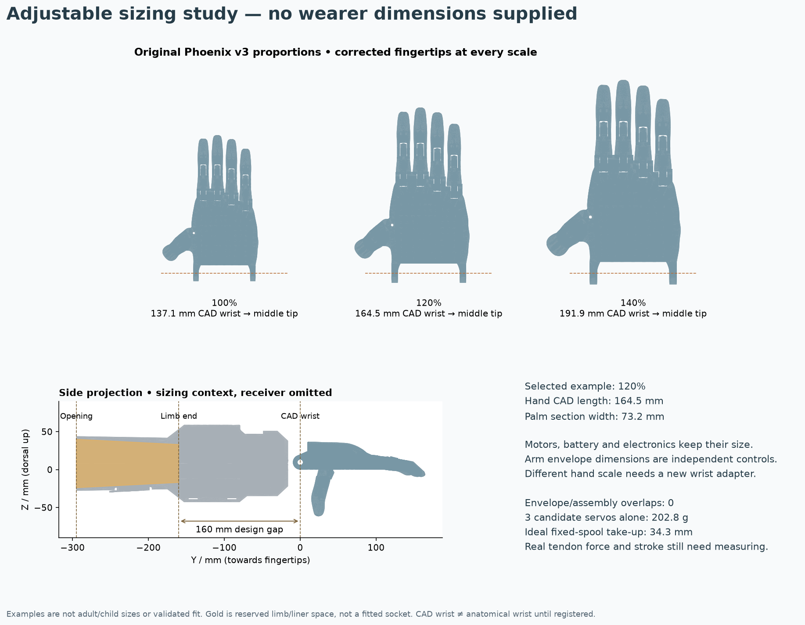

# Adjustable Phoenix v3 sizing

The hand can change size while keeping the original v3 proportions. Edit `hand_scale_percent` in [profile.json](profile.json), then rebuild. The supplied **120% is an illustration**, not an adult size, a percentile or a size chosen for a wearer. The comparison uses 100%, 120% and 140% of the downloaded STEP geometry.



[Scaled hand STEP](exports/scaled_hand.step) · [Limb/liner clearance STEP](exports/limb_clearance_envelope.step) · [Dimension and clearance report](exports/sizing_report.json)

These are sizing studies alongside the [0.4.3 mechanical assembly](../forearm/README.md). The [separate adapter build](ADAPTER.md) connects the 120% example to the forearm using a new receiver and two local lower-shell screw-head clearances. Changing the sizing profile alone still does not rebuild the receiver or shell: run that adapter build and check its report. The side view on this page remains the independent sizing study and deliberately omits the receiver.

## What changes

| Control | Effect |
| --- | --- |
| `hand_scale_percent` | Uniformly scales the eleven original hand solids about the CAD wrist datum, including the corrected thumb and fingertips. Joint centres, finger lengths and palm shape remain in proportion. |
| `comparison_scales_percent` | Shows up to five sizes at a common drawing scale. These are design examples, not population size bands. |
| `opening_y_mm`, `distal_end_y_mm` | Set the ends of an independent clearance envelope reserved for the residual limb and its interface. They do not move the motors. |
| Proximal/distal width and depth | Change the two elliptical envelope sections independently. Width and depth are separate because circumference alone does not describe limb shape. |
| `axis_z_mm` | Moves the clearance envelope vertically for packaging studies. |
| `measurements` | Optional measured dimensions and registered landmarks. Leave unknown values as `null`. Missing data cannot produce a fit claim. |

The default envelope copies the existing CAD taper at the actual opening plane (about 69.77 × 63.80 mm), rather than rounding it outward to 70 × 64 mm. The extra decimal places come from CAD interpolation, not precise human measurements.

The motor, spool, battery, boards and switches keep their real CAD size. A different hand scale requires a new receiver and a check of the wrist axle, original printed pins, tendons and clearances. Scale the matching **original printed hand parts and pins** together using the official v3 files; do not scale bought screws, servo splines or the forearm assembly. This exporter supplies STEP reference geometry, not a newly validated set of printable source-hand STLs.

[e-NABLE's sizing guide](https://hub.e-nable.org/p/devices?p=e-NABLE+Device+Sizing) recommends virtual fitting and considers length and width separately. Its [v3 catalogue](https://hub.e-nable.org/s/e-nable-devices/wiki/208/e-nable-phoenix-hand-v3) describes a wrist-powered hand requiring a functional wrist and enough palm. We reuse that hand geometry; its original attachment is not a transradial socket.

## Landmarks before averages

In this CAD, Y=0 is the Phoenix mechanical wrist pin axis, +Y points toward the fingers and +Z is dorsal. That pin axis has not been registered to a person's anatomical wrist. The hand length reported here is the **Y projection from this CAD datum to the middle fingertip in the displayed rest pose**, not automatically a standard human hand-length measurement.

The palm-width value is the source palm's X extent in a narrow section at Y=60 mm, scaled with the hand. It excludes the misleading overall spread-hand bounding box. It is a reproducible CAD comparison station, not a recognised anthropometric landmark. Only enter `cad_palm_width_target_mm` after aligning an opposite-hand trace or scan to the model and choosing the corresponding station.

If a wearer is available later, register the opposite wrist and hand to the CAD, and record the signed offset `cad_wrist_distal_to_anatomical_wrist_mm`. Positive means the CAD joint is farther toward the fingertips. The checker then compares:

```
available distal space = elbow-to-opposite-wrist + wrist offset - elbow-to-residual-tip
hand length from anatomical wrist = scaled CAD length + wrist offset
```

Length-only and width-only scale suggestions stay separate. A single uniform scale may not match both. Do not stretch only one axis of the original joints to hide a mismatch. Virtual fitting, a different hand geometry or a deliberate redesign would be needed.

## Arm length is the main packaging constraint

The present motor/electronics layout needs **160 mm from the limb end to its CAD wrist datum**. The socket opening is another 135 mm proximally. These are design assumptions, not human averages. An 80 mm desired gap does not become feasible by changing `distal_end_y_mm`: the motors remain where they are and the envelope intersection check identifies any occupied space.

The report checks the adjustable envelope against all solids in the existing complete assembly, and the resized hand against the fixed assembly with the original receiver removed. An empty collision list means only that the tested geometry does not overlap. It does not establish room for a liner, wires, tissue movement or a good attachment. The envelope is a two-section geometric reserve, not a skin model, pressure map, custom socket or printable load-bearing part.

A fitted interface needs its own shape, trim lines, suspension and elbow-motion assessment. The historical [Atlas of Limb Prosthetics, chapter 8B](https://www.oandplibrary.org/alp/chap08-02.asp) discusses how these depend on residual anatomy and how test sockets can establish suspension and electrode sites. It is a 1992 reference, used here for those principles rather than a current fitting prescription. A prosthetist needs to assess the actual interface before wear.

## Human factors to carry into the fitted version

| Area | Design requirement and evidence still needed |
| --- | --- |
| Length and alignment | Match the registered opposite arm/hand where appropriate; assess reach and hand orientation. Repackage if the available distal space is too short. |
| Elbow and forearm movement | Check the proximal edge through the wearer's available elbow flexion and forearm rotation. The current opening position does not establish clearance. |
| Skin and attachment | Use a fitted, removable interface. Check pressure-sensitive areas, suspension, slip and edge contact. CAD ellipses and straps do not establish comfortable retention. |
| EMG | Place the dry electrode over a usable, signal-tested muscle site with stable skin contact. Do not choose the site just because it is the thickest or fattiest part of the arm. The present lower window is only an access provision; relocate it if the assessed site differs. |
| Donning and release | Demonstrate one-handed fastening, reachable power disconnect and an accessible tendon-release method. Power off alone may not release a geared servo's grip. |
| Heat and service | Keep battery/electronics separated from the interface; verify temperature, sweat exposure, wiring strain relief and access for removal. |
| Bulk and balance | Review the actual forearm section and measured mass, not just the outside silhouette. Avoid making the hand longer to hide the same equipment. |

The [DFRobot SEN0240 documentation](https://wiki.dfrobot.com/sen0240) identifies the dry-electrode sensor and its signal conditioning. It does not establish a fitted electrode location on a particular residual limb. The existing independently strapped carrier must be checked during signal testing rather than tightened to compensate for poor placement.

## Scaling affects travel and weight

The fixed 12.3 mm spool radius and assumed 160° sweep give 34.35 mm of ideal take-up. With the existing 3 mm slack allowance, the remaining ideal budget is 31.35 mm. At 120% hand scale, a first-order similarity estimate limits the **100% hand-only closure stroke to 26.12 mm**; at 140% it is 22.39 mm. Actual closure travel is still unknown. This estimate scales only the hand's stroke, not the fixed upstream routing, and does not model return-band changes or friction. Use the [measured-pull test](../../calculations/MEASURED-PULL.md) after resizing and rerouting.

The three candidate FT5425BL servos alone weigh **202.8 ± 3 g**, using the manufacturer's 67.6 ± 1 g specification. This excludes battery, plastics, fasteners and every other part. The checker calculates their approximate gravity moment about the elbow only when the elbow/wrist registration is supplied, using case centres as mass-centre estimates and a horizontal forearm. It does not invent an overall device mass or a comfortable load threshold. [Manufacturer specification](https://www.feetechrc.com/Data/feetechrc/upload/file/20210810/6376418710101296552903409.pdf), page 4.

## Rebuild and checks

Using the same CadQuery environment as the forearm:

```sh
python cad/sizing/build.py
python cad/sizing/build.py --profile my_profile.json --output /tmp/my-sizing-study
python tests/anthropometry_test.py
```

The build checks eleven valid source-derived hand solids, STEP round-trip bounds, volume scaling and the two sets of geometric intersections described above. Output hashes and source/profile hashes are recorded in `exports/sizing_report.json`. The source STEP is unchanged. Tests exercise missing data, landmark-offset signs, independent length/width suggestions, fixed equipment-space requirements and insufficient tendon stroke. Existing 0.4.3 motion results apply to that assembly, not automatically to a resized hand and a future new receiver.
