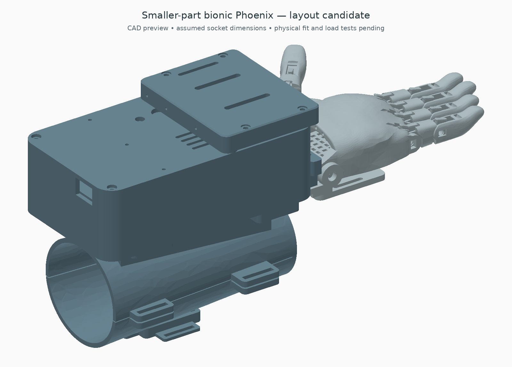
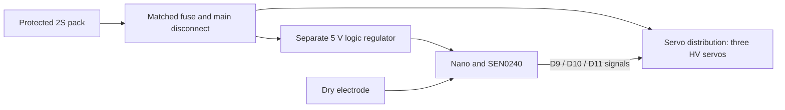

# Smaller-part housing candidate

This is an optional replacement-parts design, developed after prototype 0.2.1. It keeps the Phoenix hand, thumb placement, right forearm shell, EMG holder, spool radius and three-servo arrangement. **It requires different servos and power wiring; do not fit the existing unidentified servos or use the old servo power diagram unchanged.**



## What becomes slimmer

The main housing changes from **94 × 160 × 60 mm to 94 × 160 × 50 mm**: 10 mm, or 16.7%, less maximum height. Housing plus cassette changes from 73 to 63 mm above the housing underside: 13.7% less height. Width and length are retained so the socket, receiver and mounting centres stay compatible. These percentages describe the actuator pack, not the entire hand/socket volume.

- Three **FEETECH FT5425BL** low-profile positional servos replace the generic DS3225-size reference bodies.
- The classic 5 V **Arduino Nano is retained**, using soldered, strain-relieved leads instead of tall plug-in headers. Its 8 mm installed-height allowance must be measured, including USB connector, insulation and lead exits.
- The **SEN0240 and its electrode remain unchanged**.
- The old large servo regulator is omitted in this candidate. Servos use a protected 2S battery rail; the separate 5 V logic regulator remains. This saves a component but requires a revised high-current supply assessment.
- The complete tendon cassette moves down 10 mm. Equaliser stroke remains 38 mm; the wrist guide stays in place, so flexible liner lengths and bends must be re-established.

Servo case reference: 40.6 × 20 × 30 mm; positional travel 180° ±5° with 500–2500 µs commands and a 20 ms period. The manufacturer's drawing/actual sample must establish the final ear, shaft and horn fit. CAD presently reserves 24 × 55 × 4 mm ears and 5 mm above the case before the printed spool. These are allowances, not manufacturer drawing dimensions. [FEETECH specification, pp. 3–7](https://www.feetechrc.com/Data/feetechrc/upload/file/20210810/6376418710101296552903409.pdf).

## Force screen

Using the unchanged 12.3 mm effective spool radius, 60% assumed routing efficiency and 1.5 load margin, torque allowance is the smaller of 40% stall torque and the manufacturer's rated torque:

| Supply at servo | Torque allowance (kgf·cm) | Paired tendon pull, each | Thumb tendon pull | Three simultaneous stalls |
| --- | ---: | ---: | ---: | ---: |
| 6.0 V | 6.8 | 10.84 N | 21.69 N | 10.2 A |
| 7.4 V | 8.3 | 13.23 N | 26.47 N | 13.2 A |
| 8.4 V | 9.5 | 15.15 N | 30.30 N | 15.0 A |

Generated values are in `forces.json`; run `python cad/slim/forces.py`. Ideal 160° take-up remains 34.35 mm. Actual firmware starts with its small setup sweep. Compared with the earlier 13.4 N-per-finger screen, this candidate is similar at nominal 7.4 V but weaker at 6 V. Neither calculation establishes actual grip performance. Measure full-path tendon force and voltage sag before accepting the substitution.

A manufacturer rated-torque figure does not prove enclosed continuous duty. The previous 40% allowance was also an assumption. Heating and duty cycle still need measurement.

## Replacement BOM and power changes

| Item | Quantity | Candidate requirement |
| --- | ---: | --- |
| FT5425BL positional servo | 3 | Confirm exact revision, dimensions and metal-horn fit before ordering; no verified price quoted |
| Classic Nano | 1 retained | Low soldered connections, 8 mm installed-height allowance |
| SEN0240 kit | 1 retained | Same board/electrode; do not substitute a 3.3 V controller without checking analogue compatibility |
| Protected 2S battery | 1 | Existing 70 × 32 × 22 mm space is still an assumption; select and measure an actual pack, protection and connector |
| Logic regulator | 1 retained | 5 V D24V5F5; confirm dropout and EMG noise at lowest pack voltage |
| Servo regulator | 0 | Direct protected 2S supply for this candidate only |
| Main disconnect, fuse, connectors and distribution | 1 set | Re-select and verify for the new current path; old 10 A switch/pack and 7.5 A fuse are not accepted by this design |
| Nano lead insulation/strain relief | 1 set | Allow access for service; no exposed powered pads against shell |
| Servo horns and mounting hardware | 3 sets | Match actual 25T/5.9 mm output and printed spool slots; verify axial fastening |

At full battery voltage the datasheet permits a combined 15 A stall demand. Size the complete path for the intended current limit, conductor ratings and protection coordination; a battery's advertised C-rating alone is insufficient. The CAD reserves the old fuse/distribution/switch volumes, **not a verified 15 A parts set**. Real parts may force a housing adjustment. Do not simply increase the old fuse. No new battery/runtime/cost claim is made.

Power topology for bench development:



Join signal and power grounds at the distribution reference; route motor returns away from EMG leads. The generic-servo 5 V supply diagram in the main build guide applies to 0.2.1, not this optional candidate. Initial tests should use an appropriate current-limited bench supply. Existing averaging/control code is retained; calibrate new endpoints with tendons disconnected. No additional battery monitoring or active force/current feedback is implemented.

## CAD selection

Print candidate `compact_base.stl`, `compact_tray.stl`, and `feedthrough_lid.stl` from this folder. Retain the three original single-groove spools and the 0.2.1 cassette, slider, equalisers, guide, receiver and shell files. Do not print `compact_lid.stl` for final assembly: it is the intermediate lid before liner entries. `complete_slim_candidate.step` records the lowered placement. All exported individual parts have their print-coordinate Z origin at zero; use the complete STEP for assembly positions.

The change moves the two front cover screw seats down 10 mm and the two rear seats down 7 mm; remeasure screw lengths. Cassette-cover fasteners and internal clearances are unchanged. Top switches now mount directly to the 3 mm cover instead of a recessed well. The Nano USB opening remains accessible in the layout; actual plug insertion and wire bends are not swept-clearance tested.

Rebuild with CadQuery 2.8.0, trimesh, numpy, matplotlib and Pillow:

```sh
python cad/slim/build_pack.py
python cad/slim/integrate.py
python cad/slim/forces.py
```

`checks.json` covers envelope/fixture intersections and generated pack solids. `integration_checks.json` covers the full static assembly. The cassette's internal sampled poses are inherited unchanged by rigid translation; this does not establish continuous articulation or flexible-line clearance. The socket remains an unfitted placeholder, and the candidate is not ready for powered wear.

## Alternatives screened

A much narrower KST X15-1208 has a 35.5 × 15 × 32.5 mm case, but its documented default travel is only 100°. At the existing spool radius that gives about 21.5 mm take-up. Changing spool size to recover travel would reduce pull, so it was not selected as a simple substitution. [KST manufacturer specifications](https://kstservos.com/products/x15-1208-cyclic-coreless-hv-digital-servo-motor).

The AGFRC A62BHL is shorter again at 26.5 mm, but its 17 kgf·cm stall rating at 6 V gives a lower assumed working-torque ceiling than the previous reference. It could be revisited after measured tendon loads establish the required margin. [AGFRC specifications](https://www.agfrc.com/index.php?id=2439).
