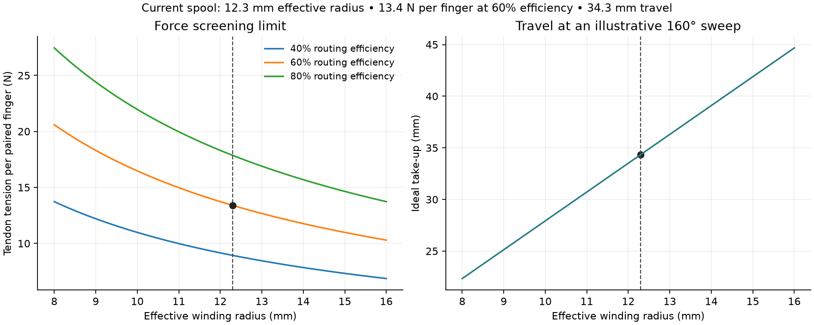

# Historical generic-servo force and travel calculation

For the current FT5425BL candidate, see [candidate ratings](../cad/slim/README.md#force-screen). To enter real measurements, use the [actuator-end pull checker](MEASURED-PULL.md). The generic 5 V estimates below are retained as history.

Generated by `python3 calculations/tendon_forces.py`. These are screening calculations, not a measurement of the Phoenix hand.

Optional plot: run `python calculations/plot_forces.py` with matplotlib installed.

## Inputs and equations

Reference stall torque at 5 V: 21 kgf·cm. Assumed working fraction: 40%; torque allowance: 0.824 N·m. Apply a separate 1.5 load margin. Neither allowance is a manufacturer continuous rating.

The new 6.75 mm-high single-groove spool retains its 12 mm groove-floor radius. With 0.6 mm line the effective radius is 12.3 mm. One line pulls a floating equaliser for each pair; one line pulls the thumb. Equal-arm, parallel-line geometry is assumed.

`required torque = margin × radius × (T1 + T2) / routing efficiency`
`equal finger tension limit = efficiency × working torque / (2 × margin × radius)`
`take-up = radius × angular travel in radians`

## Available finger-side tendon tension

| Routing efficiency | Paired fingers, each (N) | Single thumb (N) | Illustrative fingertip force per paired finger (N) |
| --- | ---: | ---: | ---: |
| 40% | 8.93 | 17.86 | 0.49 |
| 60% | 13.39 | 26.79 | 0.94 |
| 80% | 17.86 | 35.72 | 1.39 |

The fingertip column uses `(tendon tension − 4 N) × 5 mm / 50 mm`: an assumed equivalent return/friction tension, tendon moment arm and contact lever. These are not dimensions extracted from Phoenix CAD. A multi-joint finger needs pose-dependent tendon moment arms and contact geometry. Tendon tension is not grip force. The thumb column is tendon tension only.

## Torque required by an assumed load, 60% routing efficiency

| Finger-side tendon pull per finger (N) | Design torque (N·m) | Design torque (kgf·cm) | Within assumed allowance? |
| --- | ---: | ---: | --- |
| 5 | 0.307 | 3.14 | Yes |
| 10 | 0.615 | 6.27 | Yes |
| 15 | 0.922 | 9.41 | No |
| 20 | 1.230 | 12.54 | No |

Required pulls include return bands, finger-joint friction and desired contact load, but exclude routing friction already represented by efficiency. For unequal loads use their sum; a jammed finger can invalidate the equal-load assumption.

## Travel

| Usable sweep | Ideal line take-up |
| --- | ---: |
| 18° | 3.86 mm |
| 120° | 25.76 mm |
| 160° | 34.35 mm |
| 180° | 38.64 mm |

160° is an illustrative calibrated range, not the firmware command. The small initial firmware sweep is about 18° on the reference servo. For an ideal equaliser, input travel is the average of output travels; its tilt and mechanical stops must accommodate their difference. A 20/30 mm finger-travel pair needs 25 mm centre travel and 10 mm differential travel. An equaliser hitting a stop no longer shares force as assumed.

If measuring with a force gauge at the servo end through the complete routing, the total input-force screening limit is **44.65 N**. Compare `1.5 × measured input force × 0.0123 m` against 0.824 N·m; do not divide by routing efficiency again.

## What the numbers establish

At 60% routing efficiency the model supports about 13.4 N per paired finger. Two fingers requiring 10 N each are within the assumed allowance; two requiring 15 N each are outside it. Actual required closure force is unknown. Measure maximum force and travel with return bands installed, first unloaded and then on a bench contact fixture. Record breakaway peaks and the highest winding radius. Do not tighten live tendons on a wearer to establish these values.

Reducing spool height preserves the force/travel calculation; reducing radius would raise force but reduce travel. The new spool still requires real horn, screw-head, tendon-anchor and printed-strength checks. These force estimates do not validate the motor restraints, wrist cradle or socket.

[Manufacturer reference datasheet](https://dsservo.com/d_file/DS3225%20datasheet.pdf), checked 5 October 2026. The owned generic servo is not identified by this reference.
