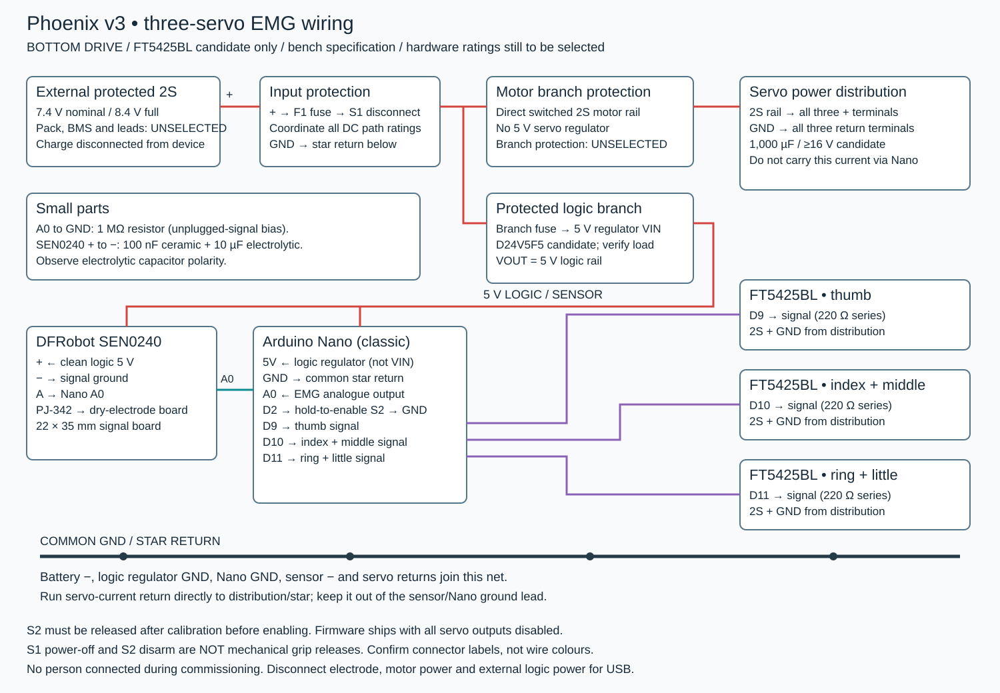

# Wiring — bottom-drive candidate

**Updated 10 October 2026. Bench specification; not approval for worn use.** The original Phoenix hand is printed; the extension is not printed and the system is not wired. Identify the actual servos before applying power. This topology is for the FT5425BL replacement candidate, not unidentified generic 25 kg·cm servos.

## Connections

| Net | Connections |
| --- | --- |
| Source positive | External protected 2S pack → source fuse F1 → accessible DC main disconnect S1 → switched supply |
| Motor branch | Switched supply → branch protection/distribution → three FT5425BL positive terminals; **no 5 V servo regulator** |
| Logic branch | Switched supply → logic branch protection → separate 5 V regulator VIN |
| Logic 5 V | Regulator VOUT → classic Nano 5V and SEN0240 +; not Nano VIN |
| Common reference | Source negative, regulator GND, servo returns and logic return meet at distribution/star reference |
| Quiet return | SEN0240 − → logic return alongside Nano ground; servo current must not pass through this lead |
| EMG | SEN0240 A → Nano A0; 1 MΩ from A0 to logic GND is the existing experimental unplugged-signal bias |
| Electrode | Dry electrode → supplied lead → SEN0240 PJ-342 socket; never connect skin contacts directly to A0 |
| Enable | D2 → normally-open momentary hold-to-enable switch S2 → logic GND; internal pull-up enabled |
| Thumb | D9 → 220 Ω series resistor → thumb servo signal |
| Index + middle | D10 → 220 Ω series resistor → paired servo signal |
| Ring + little | D11 → 220 Ω series resistor → paired servo signal |
| Sensor decoupling | Candidate 100 nF ceramic and 10 µF polarized capacitor across sensor +/−, close to conditioner; ≥10 V ratings |
| Motor reservoir | Candidate 1,000 µF capacitor across distribution, ≥16 V rating; verify polarity, ripple rating, inrush and rail overshoot |

The diagram identifies nets, not physical connector pin order. Inspect delivered labels and confirm continuity with power removed. Use keyed, insulated connectors; distinguish motor supply from logic 5 V. Document harness pin numbers and wire labels before soldering. Do not distribute servo power through a breadboard or Nano pins.

## Power parts still requiring selection

The FT5425BL sheet reports 3.4 / 4.4 / 5 A stall current at 6 / 7.4 / 8.4 V: three units could demand 10.2 / 13.2 / 15 A, before logic current. These are fault-sizing inputs, not an instruction to deliberately stall motors. Keep the candidate rail within the evaluated 6–8.4 V range, including sag and transients; never infer another servo’s supply from its torque label. [FEETECH specification](https://www.feetechrc.com/Data/feetechrc/upload/file/20210810/6376418710101296552903409.pdf)

F1, branch protection, S1, battery/BMS, connectors, wire cross-sections and cable lengths are **not selected**. Select them as a coordinated system using measured demand, fault current, fuse time/current and let-through curves, conductor/connector limits, DC interruption ratings and thermal tests. A thin logic branch needs its own protection. The old 7.5 A fuse, ≥10 A switch and 5 V servo regulator are historical, not current selections. Do not simply enlarge a fuse.

The logic-regulator reference is Pololu D24V5F5 (5 V, up to 500 mA). Confirm headroom, heat, startup and noise under the actual load and lowest loaded input. Mounting allowance is not a confirmed purchased-board fit. [Pololu](https://www.pololu.com/product/2843)

SEN0240 accepts 3.3–5.5 V and outputs 0–3 V. The separate nominal 5 V logic rail and classic Nano A0 are the intended interface. Firmware filters the biased signal and averages squared activity. The 1 MΩ bias is not a validated electrode-contact detector. [DFRobot specifications and pinout](https://wiki.dfrobot.com/sen0240/)

## Cable routing and service

Mount the conditioner beside the Nano on the rear carrier. The 22 × 35 mm PCB has a 22 × 10 × 35 mm installed envelope in CAD; this does not prove the probe plug and bend fit. Use the rear-right side entry after checking the actual grommet/plug. Keep the lead away from drums, tendons and motor current loops. Fit insulating backing and removable retention through the carrier tie slots; do not tie over components or invent PCB mounting holes.

Restrain leads at the enclosure and electrode band so solder joints and skin contacts do not carry cable loads. Retain cover-removal slack and secure excess electrode cable outside moving parts without a loose snag loop. Verify the cover cannot pinch cables. See [EMG placement](EMG-MOUNTING.md).

## First electrical checks — no person connected

1. With battery, USB, electrode, motors and regulator outputs disconnected, inspect polarity, shorts, pinning and isolation from fasteners.
2. Verify regulator output with a current-limited source and dummy load before connecting logic. Set limits from actual parts and demand.
3. Fit Nano and conditioner with motor plugs removed. Firmware ships with SERVO_OUTPUTS_ENABLED = false; check processing and absence of pulses.
4. For fixture commissioning only, identify each motor, remove horns/tendons, establish limits and deliberately enable outputs. Test one motor, then three. Log rail minima/maxima, current, temperatures and resets. Use a test signal, not a person.
5. Check S1 cuts both branches and S2 removes commands. Neither proves the hand releases: geared motors can retain a grip without power. A separate tested mechanical release is required.

For USB programming, disconnect electrode, motor power and external logic power. Any later professionally reviewed body-connected session requires an appropriate isolated arrangement; the baseline proposal is battery operation with USB, charger and mains-linked instruments disconnected. Shared grounds are **not medical isolation**. Battery operation alone does not approve human testing.

Follow the [pre-human-test procedure](PRE-HUMAN-TEST.md). Never use a person as a load or jam fixture.
